# GNPS tutorial for MS/MS data annotation
Global Natural Products Social Molecular Networking [GNPS](http://gnps.ucsd.edu) web-platform provides public data set deposition and/or retrieval through the Mass Spectrometry Interactive Virtual Environment (MassIVE) data repository. The GNPS analysis infrastructure further enables online dereplication, automated molecular networking analysis, and crowdsourced MS/MS spectrum curation. Each data set added to the GNPS repository is automatically reanalyzed in the next monthly cycle of continuous identification.
For more information, please check out the GNPS paper published in Nature Biotechnology by Ming et al 2016 [here](https://www.ncbi.nlm.nih.gov/pubmed/27504778) as well as the video and the ressource on [Youtube](https://www.youtube.com/channel/UCufTdDIUPjfoN604Igv_29g), and well as on the online [documentation](https://bix-lab.ucsd.edu/display/Public/GNPS+Documentation+Page)

### Tutorial:  Generation of Molecular Networks in 15 minutes: Exploring MS/MS data with the GNPS Data Analysis workflow

#### Step 1- Go to GNPS and create an account

Go to GNPS main page in an other window [http://gnps.ucsd.edu](http://gnps.ucsd.edu) and create your own account first (important!)
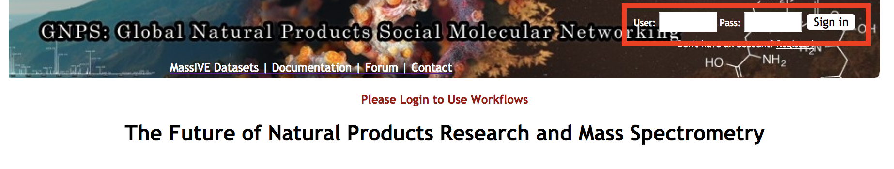

#### Step 2- Find a MS/MS dataset on MassIVE (Mass spectrometry Interactive Virtual Environment)

**A)** Go to [GNPS](http://gnps.ucsd.edu) and access the MassIVE datasets repository.
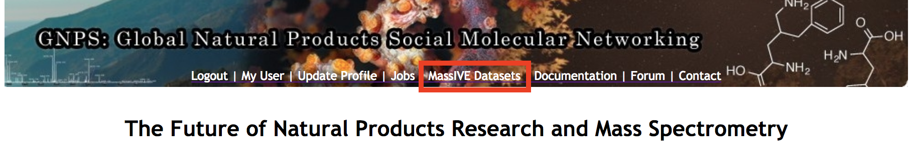

**B)** Search for the MassIVE datasets named "GNPS Workshop" (or "GNPS_AMG_SeedGrant" for a larger example with American Gut Projects samples).Explore its content, and copy the MassIVE ID number (MSV)
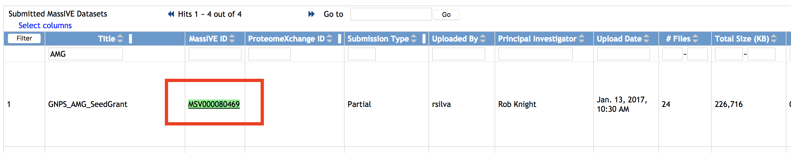

**Note:** If you want to upload your own data, follow the [DorresteinLab youtube chanel](https://www.youtube.com/channel/UCufTdDIUPjfoN604Igv_29g), here is the video:

#### Step 3 - Access to the Data Analysis workflow

Go to back [GNPS main page](http://gnps.ucsd.edu) and open the Data Analysis workflow.
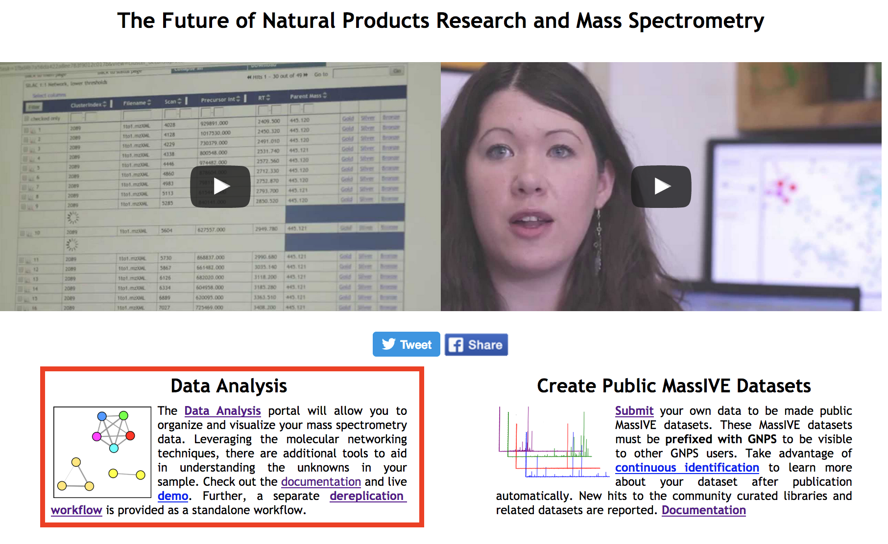

#### Step 4 - Configure and launch the Data Analysis workflow

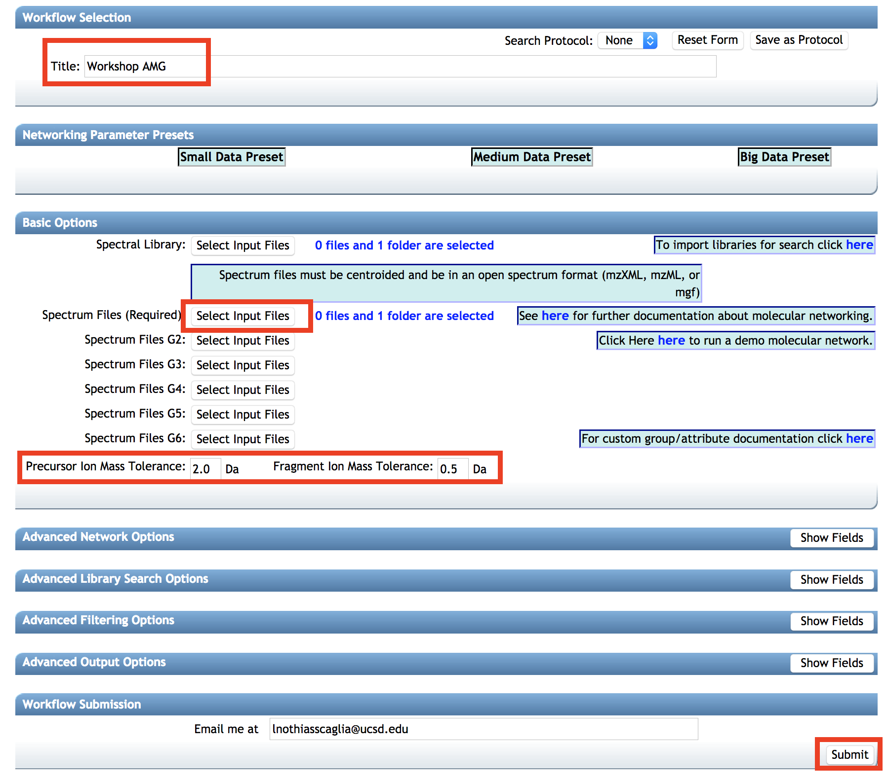

**A)** Indicate a Title.

**B)** Clic on Spectrum Files (required)
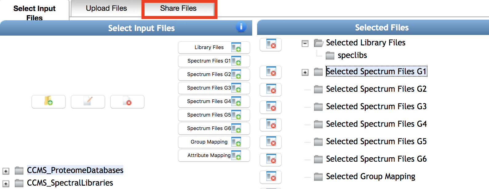

**C)** Go to the Share Files spreadsheet and import the Massive dataset files for the "GNPS workshop" or "GNPS_AMG_SeedGrant" with the Import Data Share (use the MassIVE ID).

**D)** Go back to the Select Input Files spreadsheet.

**E)** Add the files from the imported datasets "GNPS_AMG_SeedGrant" into Spectrum Files G1.
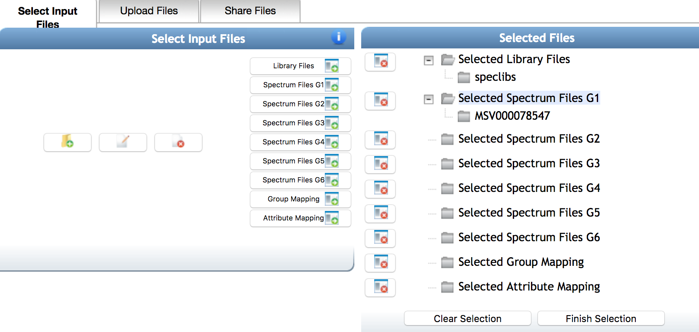

**F)** Validate the selection with Finish Selection button.

**G)** Modifiy parameters to meet high-resolution mass spectrometry: Precursor Ion Mass Tolerance (0.02), Fragment Ion Mass Tolerance (0.02), Min Pairs Cos (0.6), Minimum Matched Fragment Ions (2), Minimum cluster size (use 1)

**H)** Launch the Data Analysis workflow using the Submit button.

#### Step 5 - Visualize the Data Analysis workflow output

**A)** Return to [GNPS main page](http://gnps.ucsd.edu) and go to the Jobs page. Please find [here](http://gnps.ucsd.edu/ProteoSAFe/status.jsp?task=5b40ac0ce8194383a258ea85890ad301) an example of GNPS data analysis output with American Gut Project.
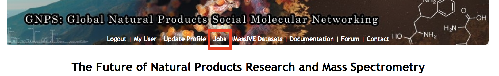
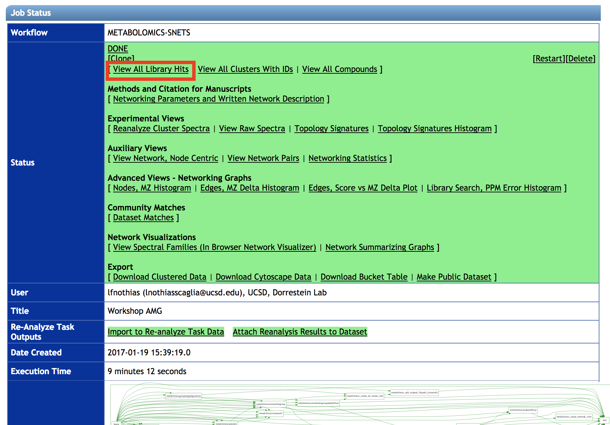
**B)** Explore the molecule annotated using public spectral library available on GNPS. Click on [View All Library Hits](http://gnps.ucsd.edu/ProteoSAFe/result.jsp?task=5b40ac0ce8194383a258ea85890ad301&view=group_by_compound).
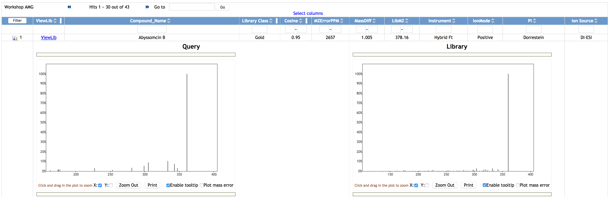
**C)** Go back to the [Status Page](http://gnps.ucsd.edu/ProteoSAFe/status.jsp?task=5b40ac0ce8194383a258ea85890ad301)
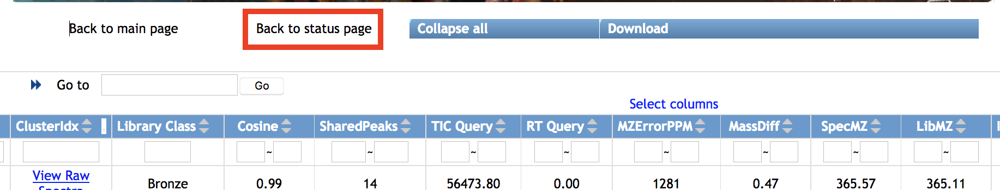
**D)** Clic on the [View Spectral families](http://gnps.ucsd.edu/ProteoSAFe/result.jsp?task=5b40ac0ce8194383a258ea85890ad301&view=network_components) and visualize the [molecular network 1](http://gnps.ucsd.edu/ProteoSAFe/result.jsp?view=network_displayer&componentindex=3&task=5b40ac0ce8194383a258ea85890ad301#%7B%7D)
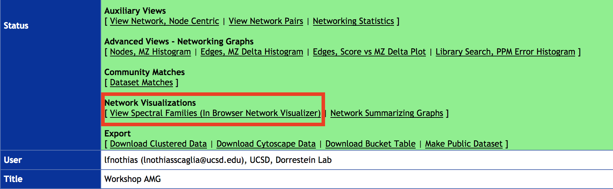
**E)** In Node Labels (bottom left), map the parent mass, or the LibraryID, in the molecular network.
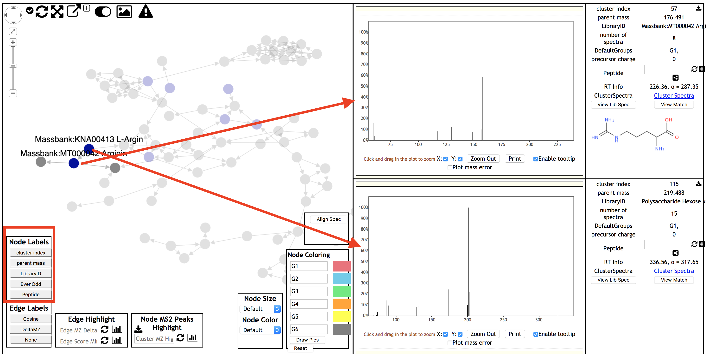
**F)** Visualize a first MS/MS spectrum by left-clicking on one node. Visualize a second MS/MS spectrum by right-clicking on a second node.

**More on navigating into the results with the following video:**

