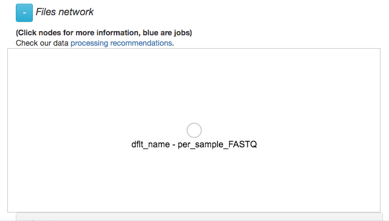
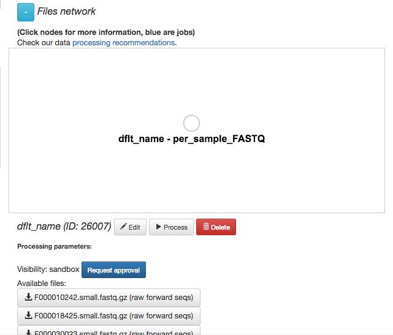
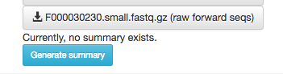
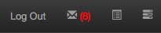
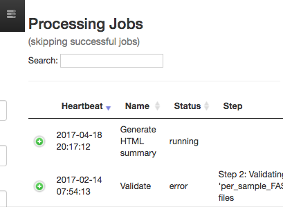
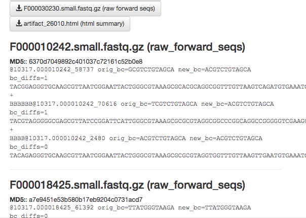
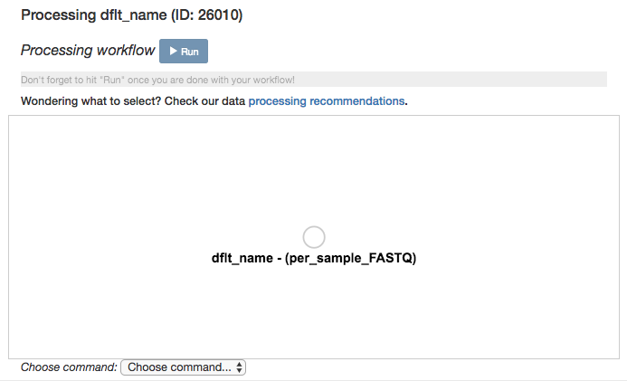
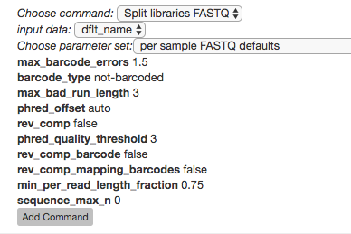
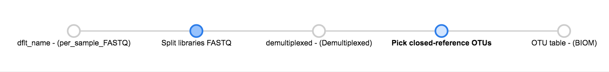

16S Microbiome Analysis in Qiita
================================

Analysis of Closed Reference processing
---------------------------------------

To create an analysis, select `Create new analysis` from the top menu.

This will take you to a list of studies with samples available to you for
analysis, divided between your studies and publically available ('Other')
studies.

.. figure::  images/analysis-studies-page.png
   :align:   center

Find the study you created for this tutorial under "Your Studies". Click the
down arrow at the left of the row. This will expand the study to expose all
the objects from that study that are available to you for analysis.

.. figure::  images/analysis-study-expanded.png
   :align:   center

You could add all of these objects to the analysis by selecting the `Add to
Analysis` button. We will just add the Closed Reference OTU table object by
clicking `Add` in that row.

.. figure::  images/analysis-closed-ref-add.png
   :align:   center

Now, the second-right-most icon at the top bar should be green, indicating that
there are samples selected for analysis.

.. figure::  images/analysis-icon-green.png
   :align:   center

Clicking on the icon will take you to a page where you can refine the samples
you want to include in your analysis. Here, all 23 of our samples are currently
included:

.. figure::  images/analysis-samples-page.png
   :align:   center

You could optionally exclude particular samples from this set by clicking on
"Show/Hide samples", which will show each individual sample name along with a
"remove" option. (Removing them here will mask them from the analysis, but will
not affect the underlying files an any way.)

This should be good for now. Click the "Create Analysis" button, enter a name and
description, then click "Create analysis".

.. figure::  images/analysis-name-analysis.png
   :align:   center

Now that you’ve created your analysis, you’ll have a Processing network displayed:

This processing network may take several minutes to load. Once the workflow loads your should see a new biom artifact. Select this artifact and click "Process"

Your closed reference .biom file is represented by the single object in this network, currently called dflt_name. Click on the object.

Now, you’ll have a series of choices for interacting with this object. You can click “Edit” to rename the object, “Process” to perform analyses, or “Delete” to delete it. In addition, you’ll see a list of the actual files associated with this object.

Scroll to the bottom, and you'll also see an option to generate a summary of
the object. 

If you click this button, it will be replaced with a notification that the
summary generation has been added to the processing queue.

To check on the status of the processing job, you can click the rightmost icon
at the top of the screen:

This will open a dialogue that gives you information about currently running
jobs, as well as jobs that failed with some sort of error.

The summary generation shouldn't take too long. When it completes, you can
click back on the biom object and scroll to the bottom of the page
to see a short peek at the data in each of the biom files in the object. These
summaries can be useful for troubleshooting.

Now, we'll process the biom table into something more interesting.

Analyzing Closed Ref 16S data
-----------------------------

Scroll back up and click on the `biom` object, and select "Process".
This will bring you to another network visualization interface. Here, you can
add processing steps to your objects.

Click again on the `biom` object. Below the files network, you will
see an option to *Choose command*. Based on the type of object, this dropdown
menu will give a you a list of available processing steps. 

There are three stages to a typical 16S analysis:
1) pre-processing
2) visualization
3) statistics

main paths for analyzing your biom tables, pre-processing and anmany potential routes available for analyzing biom tables:

For `biom` objects, the only available command is `Split
libraries FASTQ`. The converts the raw FASTQ data into the file format used by
Qiita for further analysis (you can read more extensively about this file type
`here <https://qiita.ucsd.edu/static/doc/html/tutorials/getting-started.html#preprocessing-data>`__).

Select the `Split libraries FASTQ` step. Now, you will be able to select the
specific combination of parameters to use for this step in the *Choose
parameter set* dropdown menu. 

For our files, choose `per sample FASTQ defaults, phred_offset 33`. The
specific parameter values used will be displayed below. (The other commonly
used choice for data generated at the CMI is `golay_12, reverse complement
mapping file barcodes, reverse complement barcodes`, which is what you will
select if you have one set of non-demultiplexed FASTQ files (forward, reverse,
and barcode) containing all of your samples.)

Click "Add Command". 

You'll see the files network update. In addition to the original grey object,
you should now see the processing command (represented in blue) and the object
produced from that command (also represented in grey).

.. figure::  images/processing-added-demux-command.png
   :align:   center

You can click on the command to see the parameters used, or on an object to
perform additional steps.

Note that the command hasn't actually been run yet! (We'll still need to click
"Run" at the top.) This allows us to add multiple processing steps to our study
and then run them all together.

We're going to process our sequences files using two different workflows. In
the first, we'll use a conventional reference-based OTU picking strategy to
cluster our 16S sequences into OTUs. This approach matches each sequence to a
reference database, ignoring sequences that don't match the reference. In the
second, we will use `deblur <http://msystems.asm.org/content/2/2/e00191-16>`__,
which uses an algorithm to remove sequence error, allowing us to work with
unique sequences instead of clustering into OTUs. Both of these approaches work
great with Qiita, because we can compare the observations between studies
without having to do any sort of re-clustering!

The closed reference workflow
-----------------------------

To do closed reference OTU picking, click on the `demultiplexed` object and
select the `Pick closed-reference OTUs` command. We will use the `default - 
serial` parameter set for our data, which are relatively small. For a larger
data set, we might want to use the parallel implementation.

By default, Qiita uses the GreenGenes 16S reference database. You can also
choose to use Silva, or the Unite fungal ITS database. 

Click "Add Command", and you will see the network update:

Here you can see the blue "Pick closed-reference OTUs" command added, and that
the product of the command is a BIOM-formatted OTU table.

That's it!

.. figure::  images/analysis-select-commands.png
   :align:   center

For this analysis, let's go ahead and select the commands Summarize
Taxa and Beta Diversity (Alpha Rarefaction can take some time to run).

We will also need to specify an even sampling or rarefaction depth. All the
samples in the analysis will be randomly subsampled to this number of sequences,
reducing potential biases. Samples with fewer than this number of sequences
will be excluded, which can also be useful for excluding things like blanks.

You can get a good idea of where to set this threshold by looking at the
histogram generated by summarizing the input closed-reference OTU table, as
discussed in :doc:`qiita-16S-analysis`. Here, it looks like 2100 would be an
appropriate cutoff: it excludes one clear outlier, but retains most of the
samples.

.. figure::  images/analysis-closed-ref-histogram.png
   :align:   center

Enter 2100 in the rarefaction depth field, select the check boxes for
Summarize Taxa and Beta Diversity, and click "Start
Processing". You will see a list each step in the analysis, followed by its
status:

.. figure::  images/analysis-closed-ref-running.png
   :align:   center

When the analysis is finished, click the 'Success' link to see the results.

The results page will have sections indication which samples were dropped due
to insufficient numbers of reads, as well as sections for each data type.

Here, we have taxonomy summaries and beta diversity PCoA plots available.

.. figure::  images/analysis-closed-ref-results.png
   :align:   center

Clicking on `bar_charts.html` under "Summarize Taxa" will take you to a
visualization of the taxa that were found in your sample:

.. figure::  images/analysis-closed-ref-barchart.png
   :align:   center

Under "Beta Diversity", you will have a selection of Principle Coordinates
Analyses of different measures of beta diversity, or the similarity between
samples.

Clicking on one (say, `unweighted unifrac emperor pcoa plot`) will open an
interactive visualization of the similarity among your samples. Generally
speaking, the more similar the samples, the closer the are likely to be in
the PCoA ordination. The Emperor visualization program offers a very useful way
to explore how patterns of similarity in your data associate with different
metadata categories. Here, I've colored the points in our test data by cat
ownership.

.. figure::  images/analysis-closed-ref-pcoa.png
   :align:   center

Let's take a few minutes now to explore the various features of Emperor. Open
a new browser window with the `Emperor tutorial <https://biocore.github.io/emperor/tutorial_index.html#section1>`__ and follow along with your test data.

Finally, if you ran Alpha Rarefaction, you will also have a link to interactive
plots that can be used to show how different measures of alpha diversity
correlate with different metadata categories:

.. figure::  images/analysis-closed-ref-alpha.png
   :align:   center

Analysis of deblur processing
-----------------------------

Creating an analysis of your deblurred data is virtually the same as the
process for the Closed Reference data, but there are a few quirks.

First, because the deblur process creates two separate BIOM tables, you'll want
to make a note of the specific object ID number for the artifact you want to
use. In my case, that's ID 26017, the deblurred table with 'only-16s' reads.

.. figure::  images/analysis-deblur-object.png
   :align:   center

The specific ID for your table will be unique, so make a note of it, and you
can use it to select the correct table for analysis.

Second, currently only the Beta Diversity analysis command option is working
with deblurred data.

Creating a meta-analysis
------------------------

One of the most powerful aspects of Qiita is the ability to compare your data
with hundreds of thousands of samples from across the planet. Right now, there
are almost 130,000 samples publicly available for you to explore:

.. figure::  images/analysis-qiita-stats.png
   :align:   center

(You can get up-to-date statistics by clicking "Stats" under the "More Info"
option on the top bar.)

Creating a meta-analysis is just like creating an analysis, except you choose
data objects from multiple studies. Let's start creating a meta-anlysis by adding
our Closed Reference OTU table to a new analysis.

Next, we'll look for some additional data to compare against.

You noticed the 'Other Studies' table below 'Your Studies' when adding data to
the analysis. (Sometimes this takes a while to load - give it a few minutes.)
These are publicly available data for you to explore, and each should have
processed data suitable for comparison to your own.

There are a couple tools provided to help you find useful public studies.

First, there are a series of "tags" listed at the top of the window:

.. figure::  images/analysis-qiita-tags.png
   :align:   center

There are two types of tags: admin-assigned (yellow), and user-assigned (blue).
You can tag your own study with any tag you'd like, to help other users find
your data. For some studies, Qiita administrators will apply specific reserved
tags to help identify particularly relevant data. The "GOLD" tag, for example,
identifies a small set of highly-curated, very well-explored studies. If you
click on one of these tags, all studies not associated with that tag will
disappear from the tables.

Second, there is a search field that allows you to filter studies in real time.
Try typing in the name of a known PI, or a particular study organism -- the
thousands of publicly available studies will be filtered down to something
that is easier to look through.

Let's try comparing our data to the "Global Gut" dataset of human microbiomes
from the US, Africa, and South America from the study `"Human gut microbiome
viewed across age and geography" by Yatsunenko et al <http://www.nature.com/nature/journal/v486/n7402/abs/nature11053.html>`__. We can search for this dataset
using the DOI from the paper: `10.1038/nature11053`.

.. figure::  images/analysis-yatsunenko.png
   :align:   center

Add the closed reference OTU table from this study to your analysis. You should
now be able to click the green analysis icon in the upper right and see both
your own OTU table and the public study OTU table in your analysis staging
area:

.. figure::  images/analysis-yatsunenko-selected.png
   :align:   center

You can now click "Create Analysis" just as before to begin specifying analysis
steps. This time, let's just do the beta diversity step. Select the `Beta
Diversity` command, enter a rarefaction depth of 2100, and click "Start
Processing".

Because you've now expanded the number of samples in your analysis by more than
an order of magnitude, this step will take a little longer to complete. But
when it does, you will be able to use Emperor to explore the samples in your
test dataset to samples from around the world!

.. figure::  images/analysis-yatsunenko-emperor.png
   :align:   center
