16S Microbiome Analysis in Qiita
================================

Analysis of Closed Reference processing
---------------------------------------

To create an analysis, select `Create new analysis` from the top menu.

This will take you to a list of studies with samples available to you for
analysis, divided between your studies and publically available ('Other')
studies.

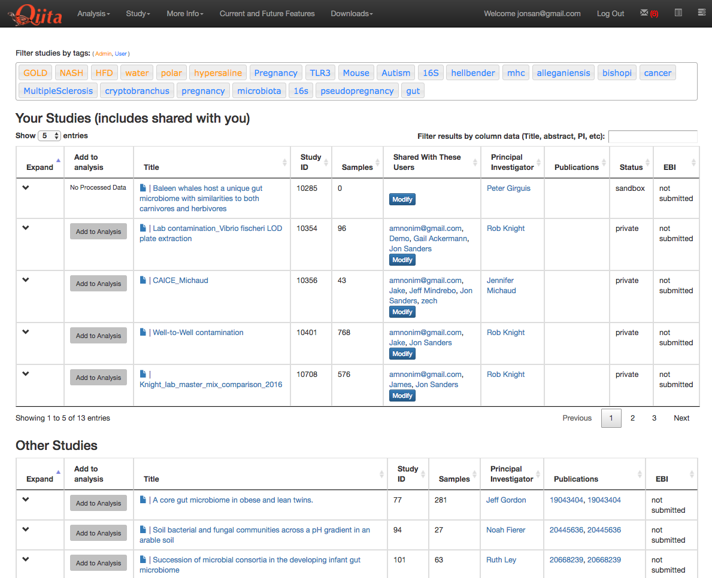

Find the study you created for this tutorial under "Your Studies". Click the
down arrow at the left of the row. This will expand the study to expose all
the objects from that study that are available to you for analysis.

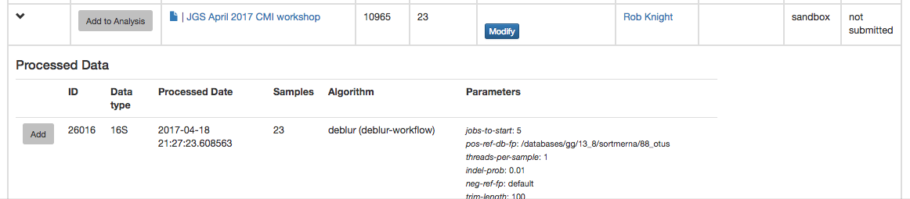

You could add all of these objects to the analysis by selecting the `Add to
Analysis` button. We will just add the Closed Reference OTU table object by
clicking `Add` in that row.

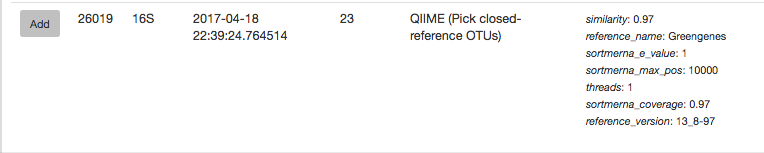

Now, the second-right-most icon at the top bar should be green, indicating that
there are samples selected for analysis.

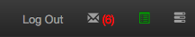

Clicking on the icon will take you to a page where you can refine the samples
you want to include in your analysis. Here, all 23 of our samples are currently
included:

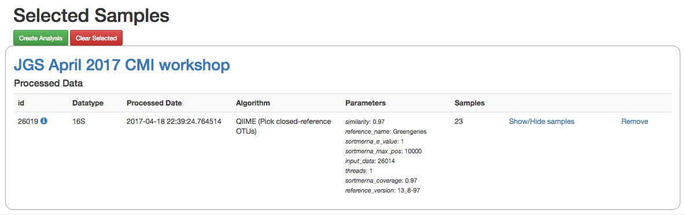

You could optionally exclude particular samples from this set by clicking on
"Show/Hide samples", which will show each individual sample name along with a
"remove" option. (Removing them here will mask them from the analysis, but will
not affect the underlying files an any way.)

This should be good for now. Click the "Create Analysis" button, enter a name and
description, then click "Create analysis".

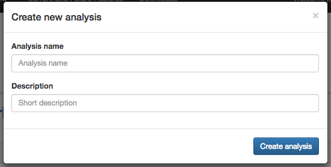

This brings you to the analysis commands selection page, where you can specify
the steps in your analysis.

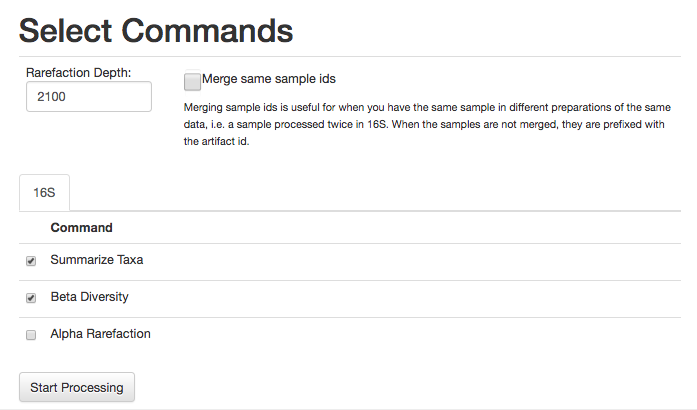

For this analysis, let's go ahead and select the commands Summarize
Taxa and Beta Diversity (Alpha Rarefaction can take some time to run).

We will also need to specify an even sampling or rarefaction depth. All the
samples in the analysis will be randomly subsampled to this number of sequences,
reducing potential biases. Samples with fewer than this number of sequences
will be excluded, which can also be useful for excluding things like blanks.

You can get a good idea of where to set this threshold by looking at the
histogram generated by summarizing the input closed-reference OTU table, as
discussed in :doc:`qiita-16S-analysis`. Here, it looks like 2100 would be an
appropriate cutoff: it excludes one clear outlier, but retains most of the
samples.

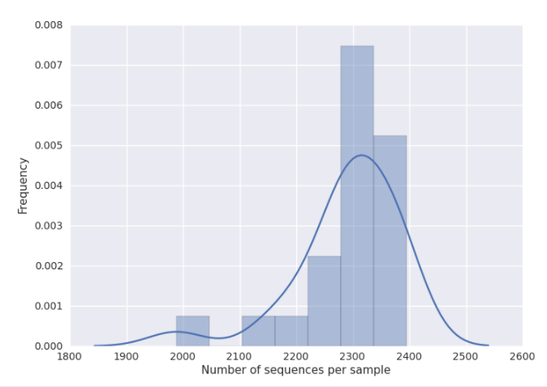

Enter 2100 in the rarefaction depth field, select the check boxes for
Summarize Taxa and Beta Diversity, and click "Start
Processing". You will see a list each step in the analysis, followed by its
status:

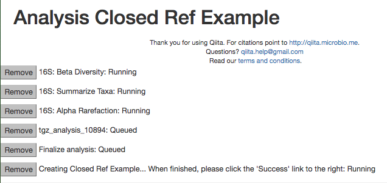

When the analysis is finished, click the 'Success' link to see the results.

The results page will have sections indication which samples were dropped due
to insufficient numbers of reads, as well as sections for each data type.

Here, we have taxonomy summaries and beta diversity PCoA plots available.

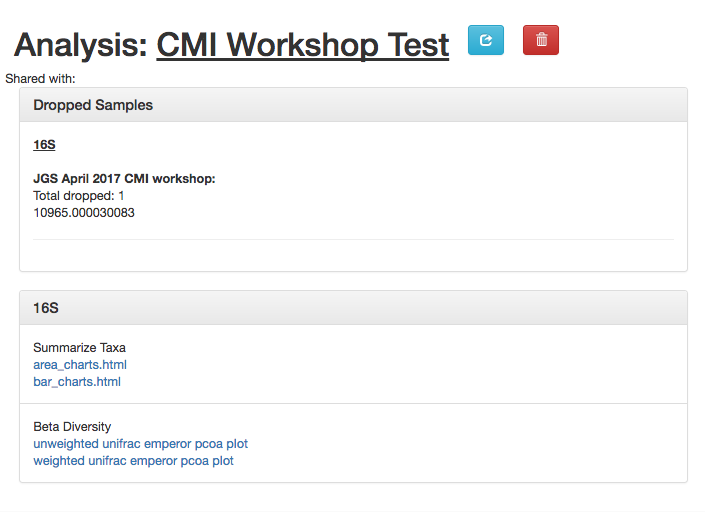

Clicking on `bar_charts.html` under "Summarize Taxa" will take you to a
visualization of the taxa that were found in your sample:

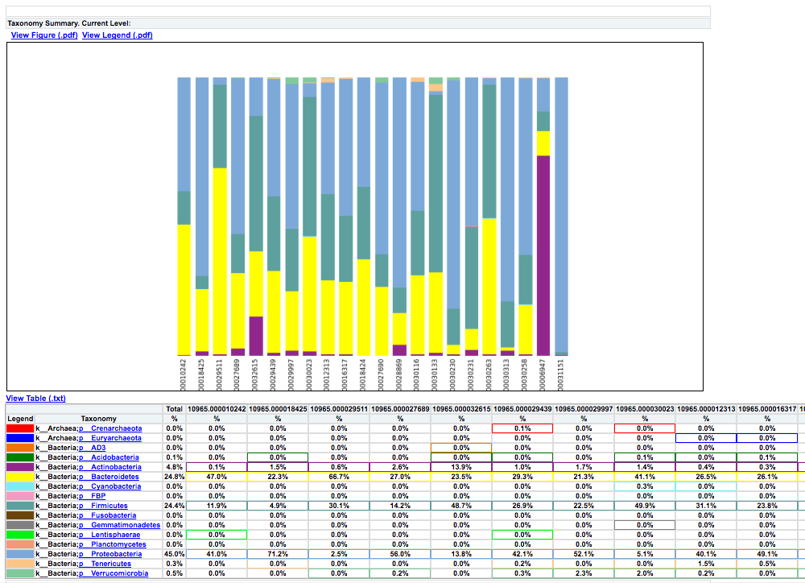

Under "Beta Diversity", you will have a selection of Principle Coordinates
Analyses of different measures of beta diversity, or the similarity between
samples.

Clicking on one (say, `unweighted unifrac emperor pcoa plot`) will open an
interactive visualization of the similarity among your samples. Generally
speaking, the more similar the samples, the closer the are likely to be in
the PCoA ordination. The Emperor visualization program offers a very useful way
to explore how patterns of similarity in your data associate with different
metadata categories. Here, I've colored the points in our test data by cat
ownership.

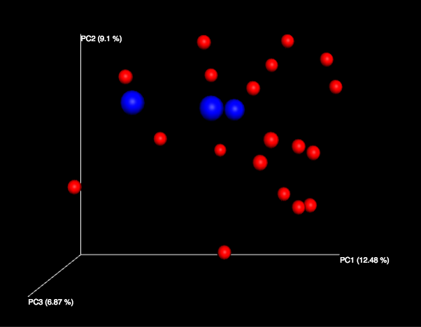

Let's take a few minutes now to explore the various features of Emperor. Open
a new browser window with the `Emperor tutorial <https://biocore.github.io/emperor/tutorial_index.html#section1>`__ and follow along with your test data.

Finally, if you ran Alpha Rarefaction, you will also have a link to interactive
plots that can be used to show how different measures of alpha diversity
correlate with different metadata categories:

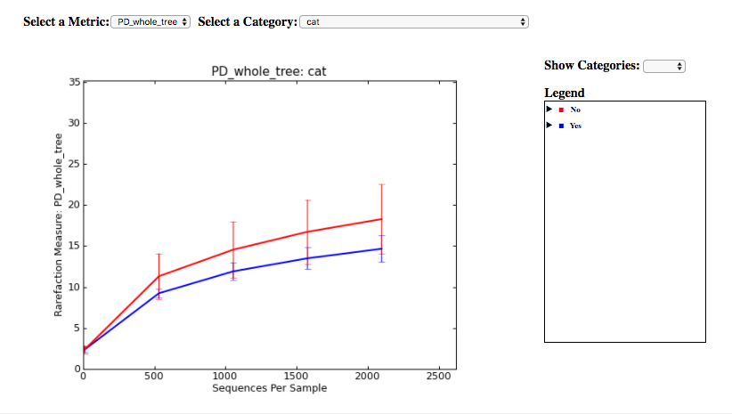

Analysis of deblur processing
-----------------------------

Creating an analysis of your deblurred data is virtually the same as the
process for the Closed Reference data, but there are a few quirks.

First, because the deblur process creates two separate BIOM tables, you'll want
to make a note of the specific object ID number for the artifact you want to
use. In my case, that's ID 26017, the deblurred table with 'only-16s' reads.

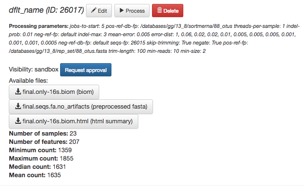

The specific ID for your table will be unique, so make a note of it, and you
can use it to select the correct table for analysis.

Second, currently only the Beta Diversity analysis command option is working
with deblurred data.

Creating a meta-analysis
------------------------

One of the most powerful aspects of Qiita is the ability to compare your data
with hundreds of thousands of samples from across the planet. Right now, there
are almost 130,000 samples publicly available for you to explore:

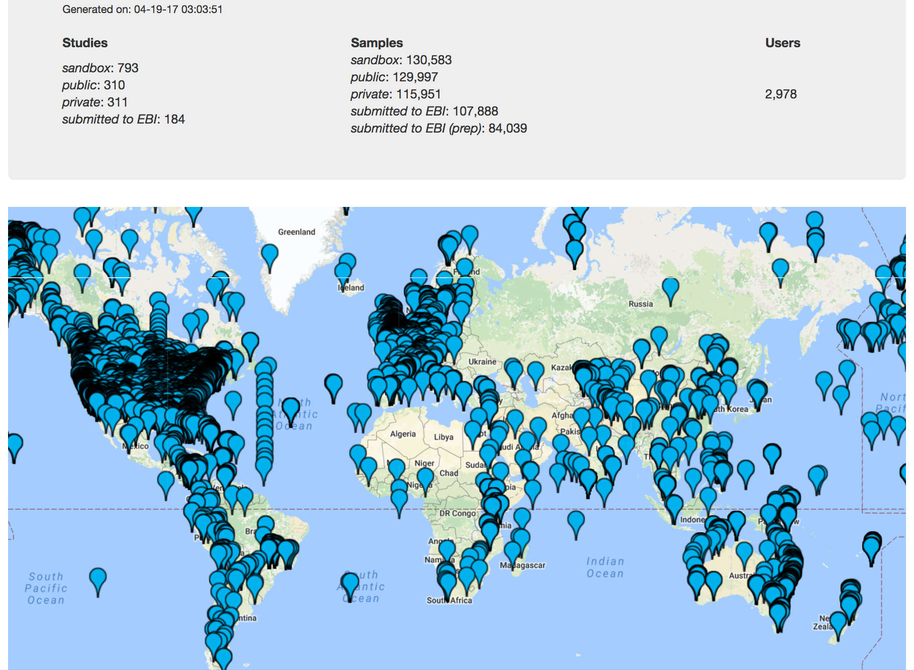

(You can get up-to-date statistics by clicking "Stats" under the "More Info"
option on the top bar.)

Creating a meta-analysis is just like creating an analysis, except you choose
data objects from multiple studies. Let's start creating a meta-anlysis by adding
our Closed Reference OTU table to a new analysis.

Next, we'll look for some additional data to compare against.

You noticed the 'Other Studies' table below 'Your Studies' when adding data to
the analysis. (Sometimes this takes a while to load - give it a few minutes.)
These are publicly available data for you to explore, and each should have
processed data suitable for comparison to your own.

There are a couple tools provided to help you find useful public studies.

First, there are a series of "tags" listed at the top of the window:

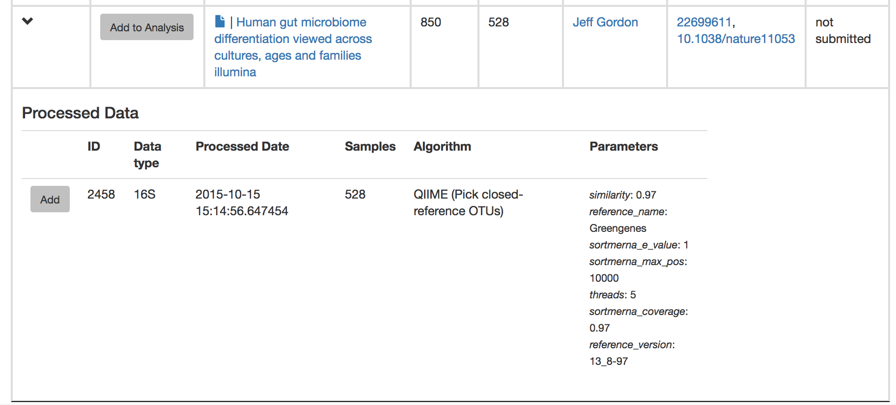

There are two types of tags: admin-assigned (yellow), and user-assigned (blue).
You can tag your own study with any tag you'd like, to help other users find
your data. For some studies, Qiita administrators will apply specific reserved
tags to help identify particularly relevant data. The "GOLD" tag, for example,
identifies a small set of highly-curated, very well-explored studies. If you
click on one of these tags, all studies not associated with that tag will
disappear from the tables.

Second, there is a search field that allows you to filter studies in real time.
Try typing in the name of a known PI, or a particular study organism -- the
thousands of publicly available studies will be filtered down to something
that is easier to look through.

Let's try comparing our data to the "Global Gut" dataset of human microbiomes
from the US, Africa, and South America from the study `"Human gut microbiome
viewed across age and geography" by Yatsunenko et al <http://www.nature.com/nature/journal/v486/n7402/abs/nature11053.html>`__. We can search for this dataset
using the DOI from the paper: `10.1038/nature11053`.

.. figure::  images/analysis-yatsunenko.png
   :align:   center

Add the closed reference OTU table from this study to your analysis. You should
now be able to click the green analysis icon in the upper right and see both
your own OTU table and the public study OTU table in your analysis staging
area:

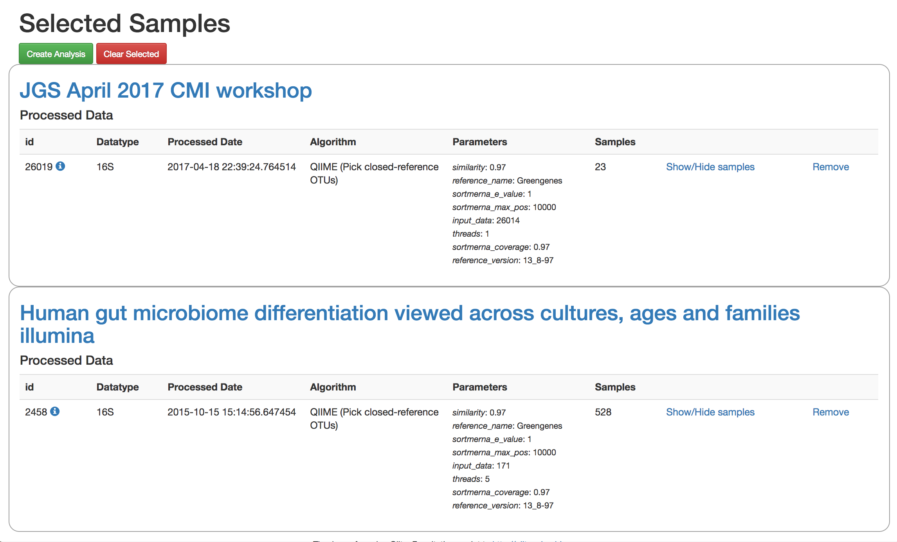

You can now click "Create Analysis" just as before to begin specifying analysis
steps. This time, let's just do the beta diversity step. Select the `Beta
Diversity` command, enter a rarefaction depth of 2100, and click "Start
Processing".

Because you've now expanded the number of samples in your analysis by more than
an order of magnitude, this step will take a little longer to complete. But
when it does, you will be able to use Emperor to explore the samples in your
test dataset to samples from around the world!

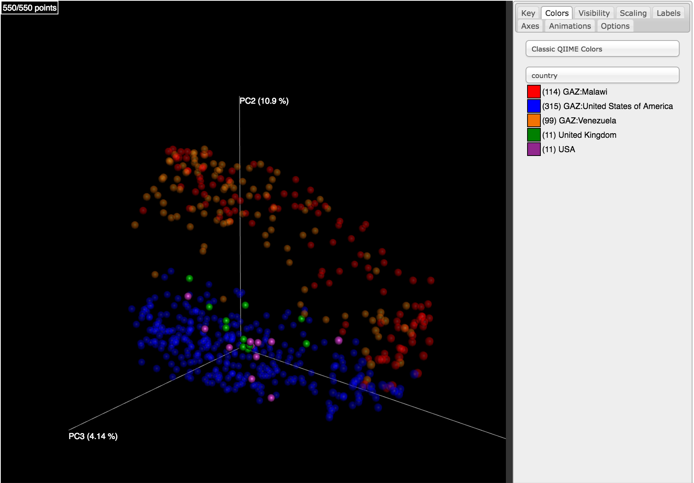
