16S Microbiome Analysis in Qiita
================================

Analysis of Closed Reference processing
---------------------------------------

To create an analysis, select `Create new analysis` from the top menu.

This will take you to a list of studies with samples available to you for
analysis, divided between your studies and publically available ('Other')
studies.

.. figure::  images/analysis_studies_page.png
   :align:   center

Find the study you created for this tutorial under "Your Studies". Click the
down arrow at the left of the row. This will expand the study to expose all
the objects from that study that are available to you for analysis.

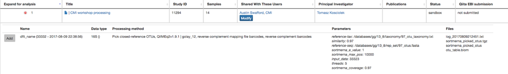

You could add all of these objects to the analysis by selecting the “Add” button. We will just add the Closed Reference OTU table object by clicking “Add” in that row.

.. figure::  images/your_study.png
   :align:   center

Now, the second-right-most icon at the top bar should be green, indicating that there are samples selected for analysis.

.. figure::  images/clipboard.png
   :align:   center

Clicking on the icon will take you to a page where you can refine the samples you want to include in your analysis. Here, all 30 of our samples are currently included:

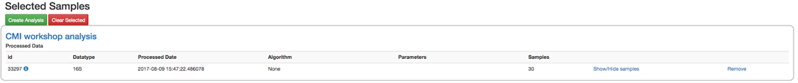

You could optionally exclude particular samples from this set by clicking on
"Show/Hide samples", which will show each individual sample name along with a
"remove" option. (Removing them here will mask them from the analysis, but will
not affect the underlying files an any way.)

This should be good for now. Click the "Create Analysis" button, enter a name and
description, then click "Create analysis".

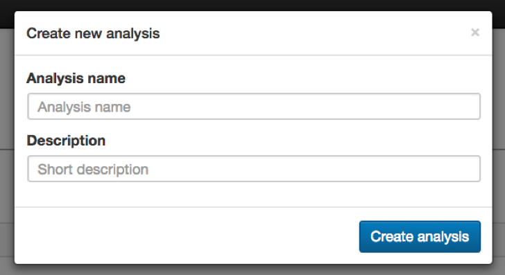

This brings you to the processing network page, where, once pulling down the “Processing Network” tab, you can analyze data that has been run.

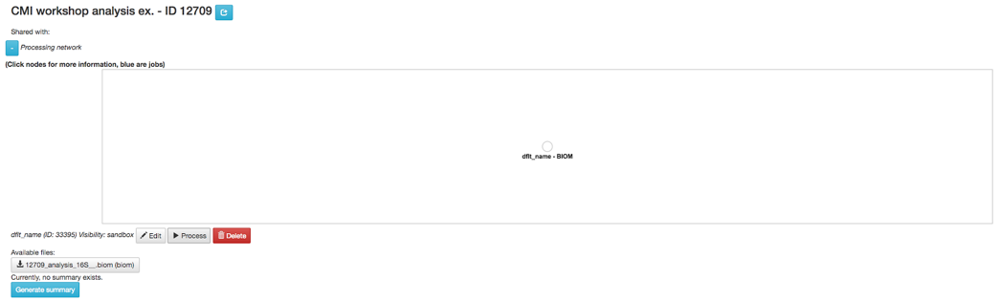

To process the data, let’s go ahead and select “Process” which will take us to the commands selection page. Once there, select “dflt_name - BIOM” so that the commands pull down tab can be accessed which will initially display five actions. 

.. figure::  images/command_options.png
   :align:   center

We will go through the use of each command which will enable you to generate summaries, plot your data, calculate statistics to help you get the most out of your data. 

Rarefying Data
~~~~~~~~~~~~~~

To start, the data must be rarefied. This means that all the samples in the analysis will be randomly subsampled to this number of features, in this case OTUs, reducing potential alpha and beta diversity biases. Samples with fewer than this number of features will be excluded, which can also be useful for excluding things like blanks. To choose a good cutoff for your data, view the histogram generated by the summary of your data.

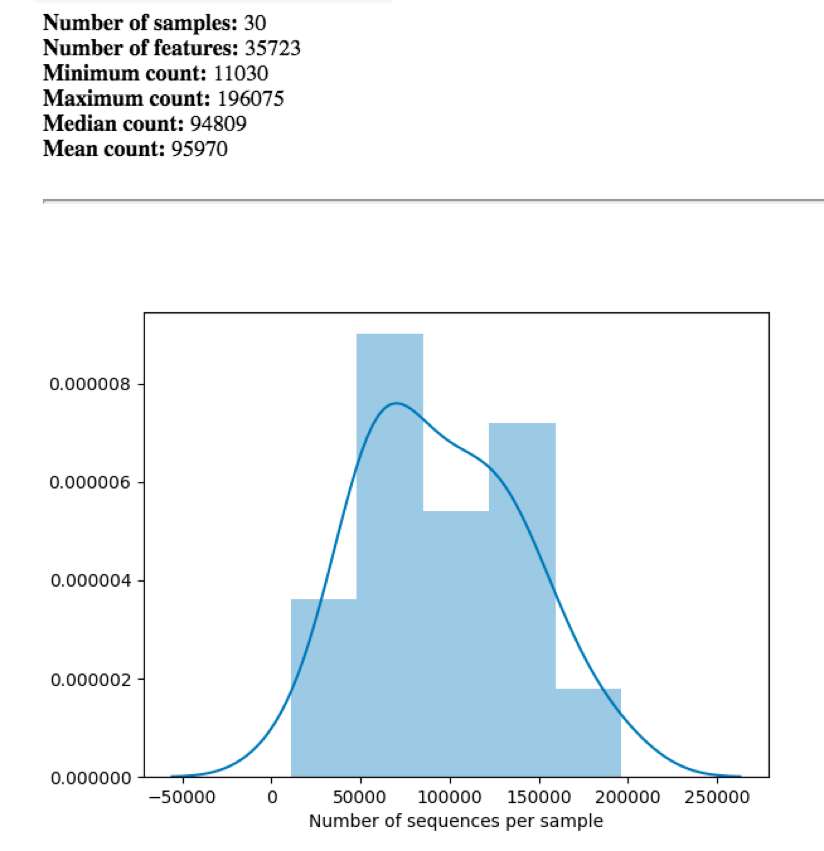

An appropriate cutoff would exclude clear outliers, but retain most of the samples. Here we have already removed blanks from our data and eliminated the outliers prior to analysis so we will just use the minimum number of features observed in our samples (11030) as the cutoff.

To rarefy the data, select Rarefy from the dropdown menu. The parameters will appear below the workflow diagram:

.. figure::  images/rarify_parameter_without_number.png
   :align:   center

Several parameter have only one option and were thus automatically selected for you. In the ‘p-sampling-depth’ field we will specify the number of features to rarefy our samples to. Enter 11030 in this box, and click ‘Add Command’. Once the command is added the workflow should appear as follows:

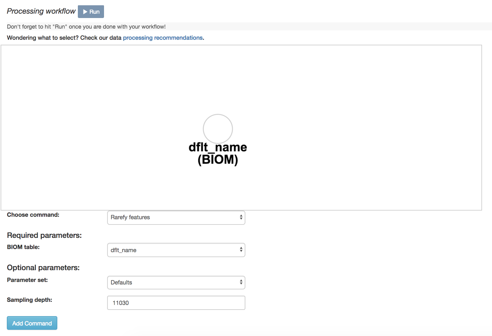

Click the run button to start the process of rarefaction. The view will return to the original screen, while the rarefaction job runs. Refresh your browser every 10-20 seconds until the rarefied biom table appears: 

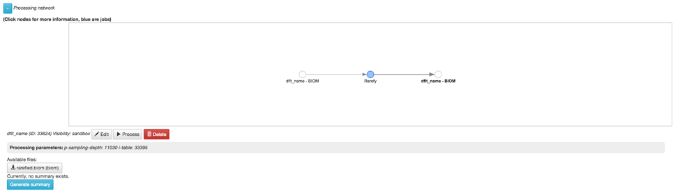

This results page will have sections indication which samples were dropped due to insufficient numbers of reads, as well as sections for each data type. Once the data is rarefied, we can begin analyzing the data.

Generating Taxa Bar Plots
~~~~~~~~~~~~~~~~~~~~~~~~~

When creating a closed reference biom table, each sequence is matched to the Green Genes database with 97% accuracy, and assigned a taxonomy (See this section for a refresher on 16S data <http://cmi-workshop.readthedocs.io/en/latest/qiita-16S-processing.html>`__). This enables us to display this data to view the percentage of each taxa within each sample. When using ‘Deblurred’ data, there is no taxa assignment since features are kept as individual error-corrected sequences, so you can skip to the next section “Alpha Diversity Analysis”.

To display the taxonomic profiles of our samples, we will select our rarefied data artifact, and click Process. The same processing view we saw previously now appears, so click on ‘taxa_barplot’ from the dropdown menu to arrive at the following view:

.. figure::  images/taxa_barplot_parameter.png
   :align:   center

All of the parameters for this command are fixed so simply click ‘Add Comand’ to continue. Once the command is added the workflow will appear:

.. figure::  images/taxa_barplot_run.png
   :align:   center

Click the run button to start the process. The view will return to the original screen, while the taxa barplot generation job runs. Refresh your browser every 10-20 seconds until the q2 visualization object biom table appears:

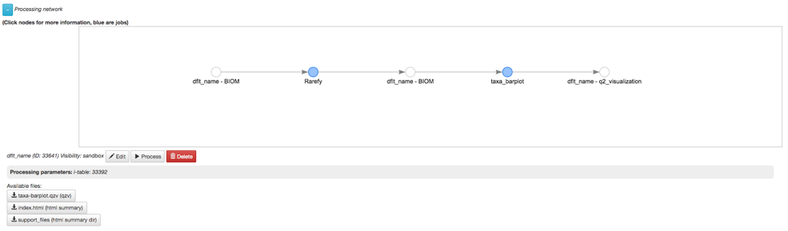

The taxa barplot will appear below the processing network.The taxa plots offers visualization of the makeup of each sample. Each color will represent a different taxa and each column a different sample. It will have 4 pulldown menus: Taxonomic Level, Color Palette, and 2 Sort Samples By options

.. figure::  images/taxa_barplot.png
   :align:   center

The Taxonomic Level pulldown allows you to view the taxa within your samples at different specificities. There are 7 level options: 1- Kingdom, 2- Phylum, 3- Class, 4- Order, 5- Genus, 6- Species, 7- Subspecies. 

The Color Palette pulldown allows you to change the coloring of your taxa barplot. You can select through “Discrete” palettes in which each taxa is a different color or “Continuous” palettes in which each taxa is a different shade of one color.
The Sort Sample By pulldowns allow you to sort your data either by sample metadata or taxonomic abundance and either by ascending or descending order. 

Alpha Diversity Analysis
~~~~~~~~~~~~~~~~~~~~~~~~

Next, one can also analyze alpha diversity. Alpha diversity is the diversity within a sample. This is used to analyze data within rather than across samples. One type of analysis for alpha diversity is looking at observed OTUs. This type of analysis will provide the amount and types of OTUs (or operational taxonomic units) that are found in a sample.

To create an observed OTU analysis, set the command as the following: 

.. figure::  images/observed_OTU_parameter.png
   :align:   center

Once the command is added the workflow will look like:

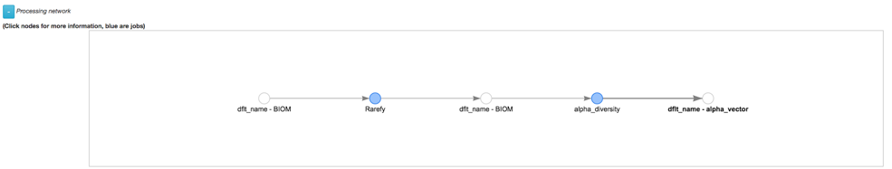

Another type of alpha diversity analysis is the Shannon diversity index. This analyzes the amount of taxa per the total amount of taxa. It takes into account both diversity as well as abundance.  

To create a Shannon diversity index, set the command as the following: 

.. figure::  images/shannon_diversity_parameter.png
   :align:   center

Once the command is added the workflow will look like:

.. figure::  images/shannon_diversity_workflow.png
   :align:   center

The final alpha diversity analysis is Faith’s phylogenetic diversity index. This index also measured abundance and diversity but displays it in tree form rather than in a plot.

To create a Faith’s phylogenetic diversity index, set the command as the following: 

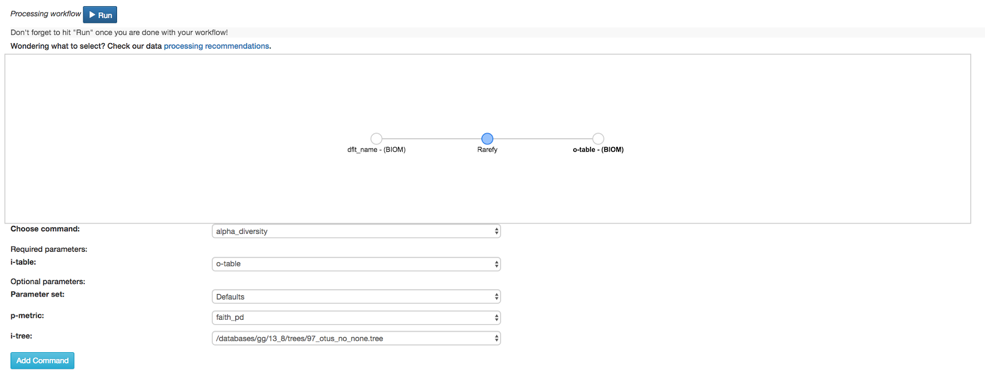

Once the command is added, the workflow will look like:

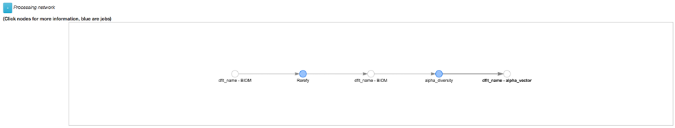

If you run Alpha Rarefaction, you will have a link to interactive plots that can be used to show how different measures of alpha diversity correlate with different metadata categories. 

Beta Diversity Analysis
~~~~~~~~~~~~~~~~~~~~~~~

Finally, one can measure beta diversity. Beta diversity measures the diversity between samples rather than within. This is used to compare samples to one another. One way to analyze this is through Bray-Curtis dissimilarity. This quantifies how dissimilar samples are to one another. 

To begin the beta analysis, set the command as the following: 

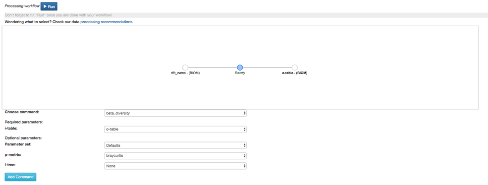

Then to create a Bray-Curtis dissimilarity principal coordinate plot, set the command as the following:

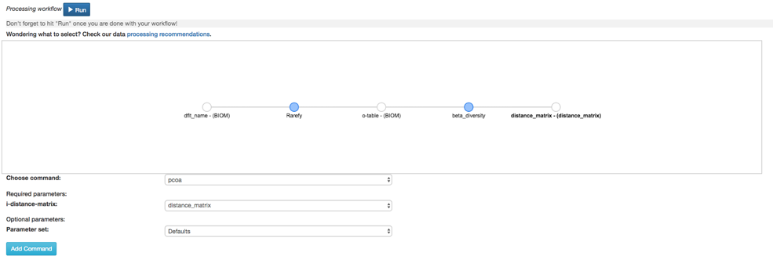

Once the command is added the workflow will look like: 

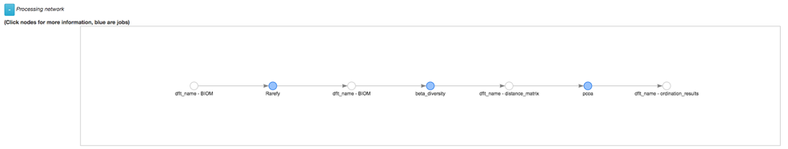

Another tool for measuring beta diversity is unweighted analysis. Unweighted beta analysis is when the types but not quantity of each taxa is taken into consideration when comparing samples to one another. This differs from weighted analysis which takes into consideration both the amount and variety of taxa in a sample. 

To begin the beta analysis, set the command as the following: 

.. figure::  images/unweighted_beta_diversity.png
   :align:   center

To create an unweighted beta analysis principal coordinate plot, set the command as the following:

.. figure::  images/unweighted_pcoa.png
   :align:   center

Once the command is added the workflow will look like:

.. figure::  images/unweighted_workflow.png
   :align:   center

The results will be displayed as principal coordinate plots. 

A final way to analyze the beta diversity is through filtered unweighted analysis. This allows you to filter out samples. 

To create an unweighted beta analysis principal coordinate plot, set the command as the following: 

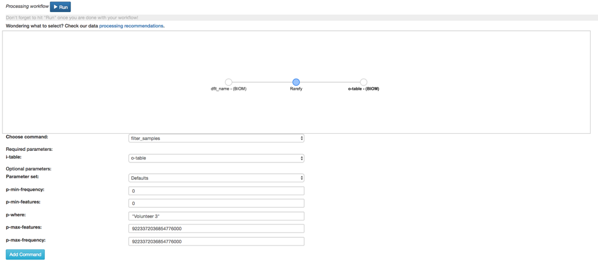

To create the beta analysis, set the command as the following:

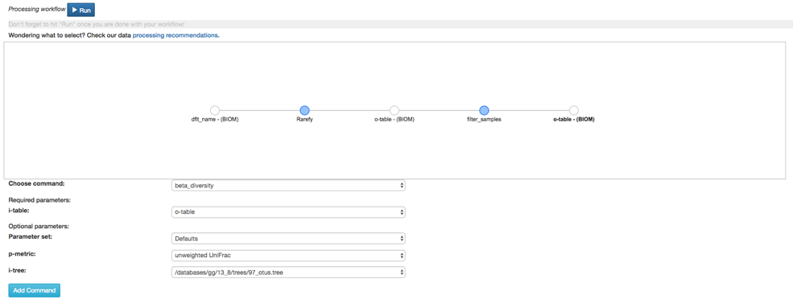

To create the filtered unweighted beta analysis principal coordinate plot, set the command as the following:

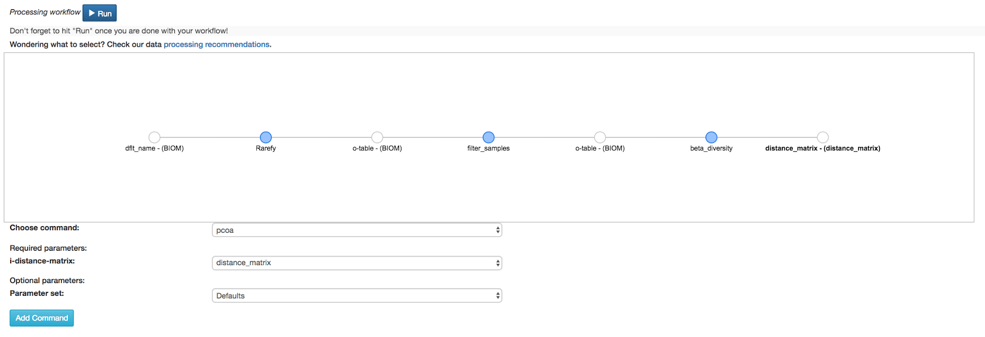

Once the command is added the workflow will look like:

.. figure::  images/filtered_unweighted_workflow.png
   :align:   center

Clicking on the pcoa (Principal Coordinate Analysis) results will open an interactive visualization of the similarity among your samples. Generally speaking, the more similar the samples, the closer the are likely to be in the PCoA ordination. The Emperor visualization program offers a very useful way to explore how patterns of similarity in your data associate with different metadata categories. Here, I’ve colored the points in our test data by cat ownership.

.. figure::  images/pcoa.png
   :align:   center

Let’s take a few minutes now to explore the various features of Emperor. Open a new browser window with the Emperor tutorial and follow along with your test data.

Altering Workflow Analysis Names
~~~~~~~~~~~~~~~~~~~~~~~~~~~~~~~~

To alter the name of a result, click the circle that corresponds to the result then use the edit button on the processing network page. 

.. figure::  images/rename_data_on_workflow.png
   :align:   center

This will cause a window to pop-up where you can input the name you’d like to replace it with.

.. figure::  images/rename_data_popup.png
   :align:   center

Analysis of Deblur Process
--------------------------

Creating an analysis of your deblurred data is virtually the same as the process for the Closed Reference data, but there are a few quirks.

First, because the deblur process creates two separate BIOM tables, you’ll want to make a note of the specific object ID number for the artifact you want to use. In my case, that’s ID 26017, the deblurred table with ‘only-16s’ reads.

.. figure::  images/deblur.png
   :align:   center

The specific ID for your table will be unique, so make a note of it, and you can use it to select the correct table for analysis.

Creating a Meta-Analysis
------------------------

One of the most powerful aspects of Qiita is the ability to compare your data with hundreds of thousands of samples from across the planet. Right now, there are almost 130,000 samples publicly available for you to explore:

(You can get up-to-date statistics by clicking “Stats” under the “More Info” option on the top bar.)

Creating a meta-analysis is just like creating an analysis, except you choose data objects from multiple studies. Let’s start creating a meta-analysis by adding our Closed Reference OTU table to a new analysis.

Next, we’ll look for some additional data to compare against.

You noticed the ‘Other Studies’ table below ‘Your Studies’ when adding data to the analysis. (Sometimes this takes a while to load - give it a few minutes.) These are publicly available data for you to explore, and each should have processed data suitable for comparison to your own.

There are a couple tools provided to help you find useful public studies.

First, there are a series of “tags” listed at the top of the window:

.. figure::  images/admin_user_photo.png
   :align:   center

There are two types of tags: admin-assigned (yellow), and user-assigned (blue). You can tag your own study with any tag you’d like, to help other users find your data. For some studies, Qiita administrators will apply specific reserved tags to help identify particularly relevant data. The “GOLD” tag, for example, identifies a small set of highly-curated, very well-explored studies. If you click on one of these tags, all studies not associated with that tag will disappear from the tables.

Second, there is a search field that allows you to filter studies in real time. Try typing in the name of a known PI, or a particular study organism – the thousands of publicly available studies will be filtered down to something that is easier to look through.

.. figure::  images/filter_results_for_meta_analysis.png
   :align:   center

Let’s try comparing our data to the “Global Gut” dataset of human microbiomes from the US, Africa, and South America from the study “Human gut microbiome viewed across age and geography” by Yatsunenko et al <http://www.nature.com/nature/journal/v486/n7402/abs/nature11053.html>`__. We can search for this dataset using the DOI from the paper: 10.1038/nature11053.

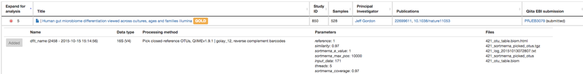

Add the closed reference OTU table from this study to your analysis. You should now be able to click the green analysis icon in the upper right and see both your own OTU table and the public study OTU table in your analysis staging area:

You can now click “Create Analysis” just as before to begin specifying analysis steps. This time, let’s just do the beta diversity step. Select the Beta Diversity command, enter a rarefaction depth of 11030, and click “Start Processing”.

.. figure::  images/sample_comparison.png
   :align:   center

Because you’ve now expanded the number of samples in your analysis by more than an order of magnitude, this step will take a little longer to complete. But when it does, you will be able to use Emperor to explore the samples in your test dataset to samples from around the world!

