Now, we'll upload some actual microbiome data to explore. To do this, we need
to add the data themselves, along with some information telling Qiita
about how those data were generated.

Adding a preparation template and linking it to raw data
--------------------------------------------------------

Where the *sample info file* has the biological metadata associated with your
samples, the *preparation info file* contains information about the specific
technical steps taken to go from sample to data. Just as you might use multiple
data-generation methods to get data from a single sample -- for example, target
gene sequencing and shotgun metagenomics -- you can have multiple prep info
files in a single study, associating your samples with each of these data types.
You can learn more about prep info files at the `Qiita documentation <https://qiita.ucsd.edu/static/doc/html/tutorials/prepare-information-files.html#prep-information-file>`__.

Go back to the "Upload Files" interface. In the `example data <https://github.com/biocore/cmi-workshops/blob/master/docs/example_data/qiita-files.zip?raw=true>`__, find and upload the **3 "FASTQ
files"** and the **"prep_information_16S.txt"** file.

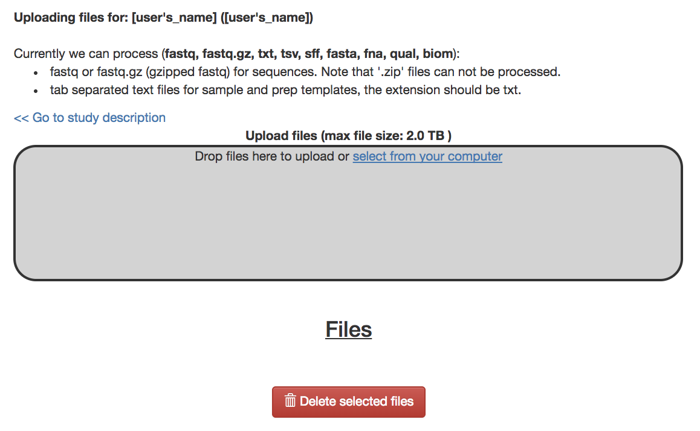

These files will appear under "Files" when they finish uploading. 

Then, go to the study description. Now you can click the "Add New Preparation" button. This will bring up the
following dialogue:

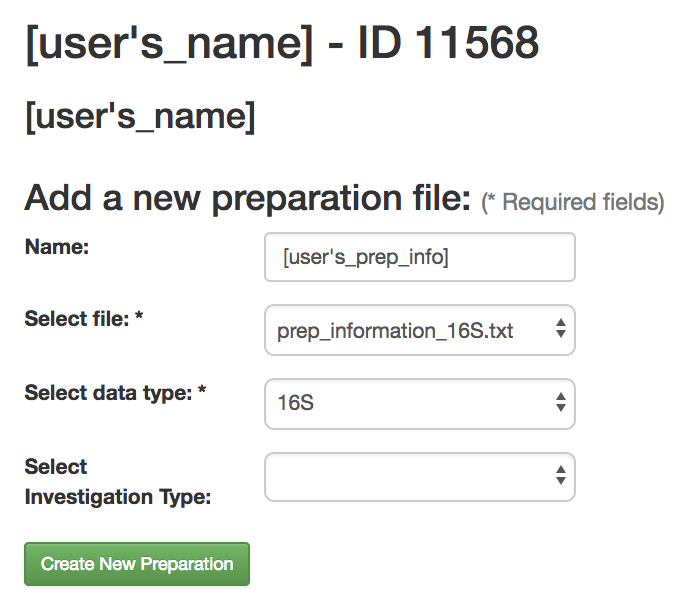

Select "prep_information_16S.txt" from the "Select file" dropdown, and "16S" as
the data type. Optionally, you can also select one of a number of investigation
types that can be used to associate your data with other like studies in the
database. Click "Create New Preparation".

You should now be brought to a "Processing" tab of your preparation info:

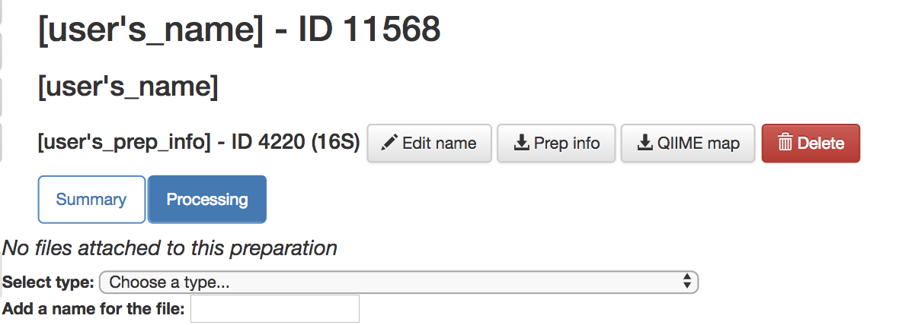

By clicking on the "Summary" tab on this page you can see the preparation info that you uploaded.

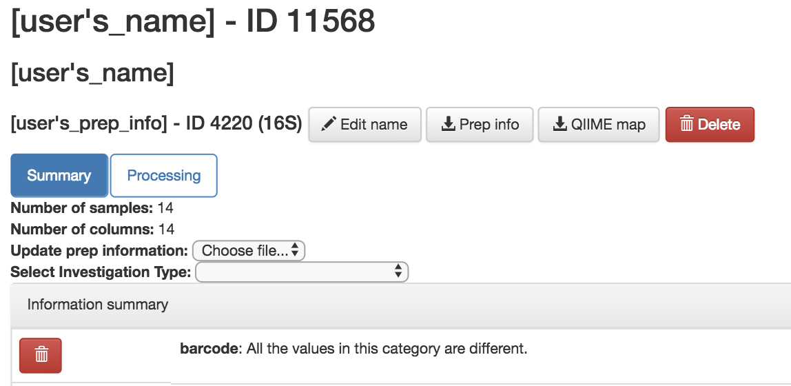

In addition, you should see a "16S" button appear under "Data Types" on the
menu to left:

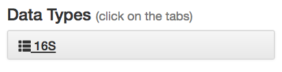

You can click this to reveal the individual prep info files of that data type
that have been associated with this study:

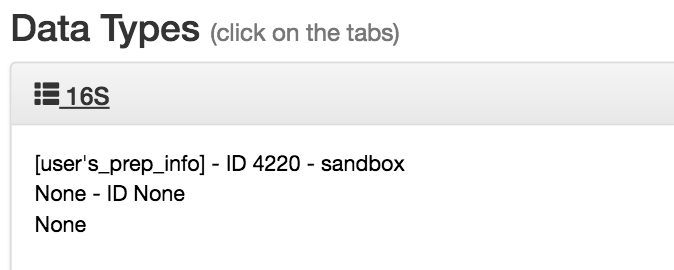

If you have multiple 16S preparations (for example, if you sequenced using
several different primer sets), these would each show up as a separate entry
here.

Now, you can associate the sequence data from your study with this preparation. 

In the prep info dialogue, there is a dropdown menu below the words *No files
attached to this preparation*, labeled "Select type". Click "Choose a type" to
see a list of available file types. In our case, we've uploaded FASTQ-formatted
file for all samples in our study, so we will choose "FASTQ - None`.

*Magically*, this will prompt Qiita to associate your uploaded files with the
corresponding samples in your preparation info. (Our prep info file has a
column named `run_prefix`, which associated the `sample_name` with the file
name prefix for that particular sample).

You should see this as filenames showing up in the green: *raw barcodes* (file with *I1* in its name),
*raw forward seqs* (*R1* in name) and *raw reverse seqs* (*R2* in name) columns 
below the import dropdown. You'll want to give the set of these
FASTQ files a name (*Add a name for the file* field below *Select type: FASTQ - None*), and then click
"Add files" below.

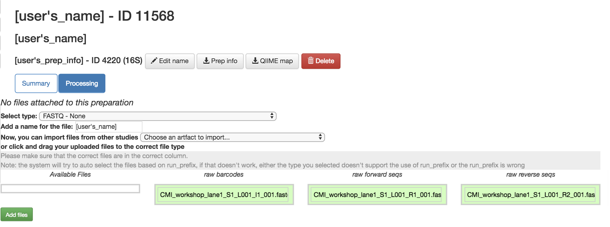

That's it! Your data are ready for processing.

Exploring the raw data
----------------------

Click on the 16S menu on the left. Now that you've associated sequence
files with this prep, you'll have a "Processing network" displayed:

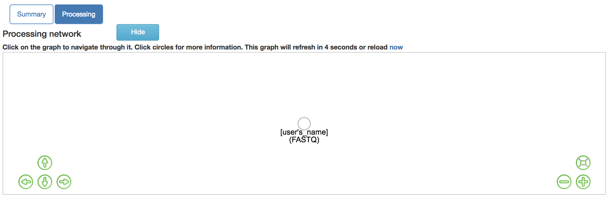

If you see this message:

   
It means that your files need time to load. Refresh your screen after about 1 minute.

Your collection of FASTQ files for this prep are all represented by a single
object in this network, currently called "[user's_name]". Click on the object.

Now, you'll have a series of choices for interacting with this object. You can
click "Edit" to rename the object, "Process" to perform analyses, or "Delete"
to delete it. In addition, you'll see a list of the actual files associated with this object.

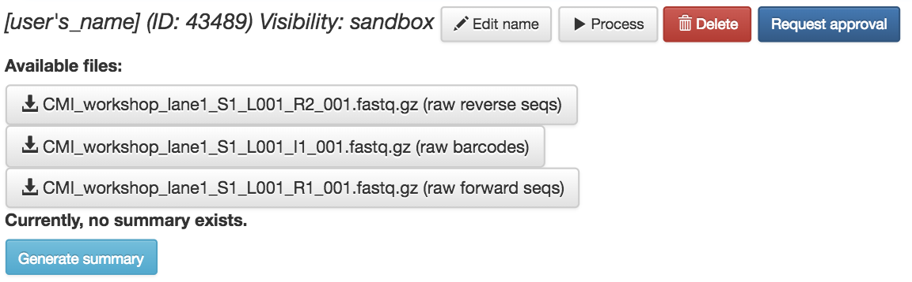

Scroll to the bottom, and you'll also see an option to generate a summary of
the object.

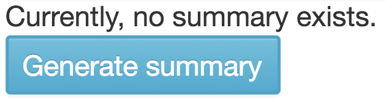

If you click this button, it will be replaced with a notification that the
summary generation has been added to the processing queue.

To check on the status of the processing job, you can click the rightmost icon
at the top of the screen:

.. figure::  images/processing-icon2.png
   :align:   center

This will open a dialogue that gives you information about currently running
jobs, as well as jobs that failed with some sort of error. *Please note*, this dialogue keeps the entire
history of errors that Qiita encountered for your jobs, so take notice of dates and times in the `Heartbeat` column.

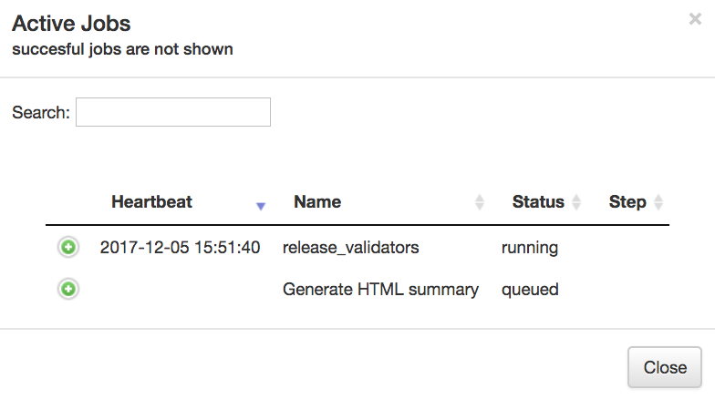

The summary generation shouldn't take too long. When it completes, you can
click back on the FASTQ object and scroll to the bottom of the page
to see a short peek at the data in each of the FASTQ files in the object. These
summaries can be useful for troubleshooting.

.. figure::  images/summary3.png
   :align:   center

Now, we'll process the raw data into something more interesting.

Processing 16S data
-------------------

Scroll back up and click on the "[user's_name](FASTQ)" artifact, and select "Process". Below the files network, you will
now see a "Choose command" dropdown menu. Based on the type of object, this dropdown menu will give a you a list of available processing steps.

For 16S "FASTQ" objects, the only available command is "Split
libraries FASTQ". The converts the raw FASTQ data into the file format used by
Qiita for further analysis (you can read more extensively about this file type
`here <https://qiita.ucsd.edu/static/doc/html/tutorials/getting-started.html#preprocessing-data>`__).

Select the "Split libraries FASTQ" step. Now, you will be able to select the
specific combination of parameters to use for this step in the "Choose
parameter set" dropdown menu.

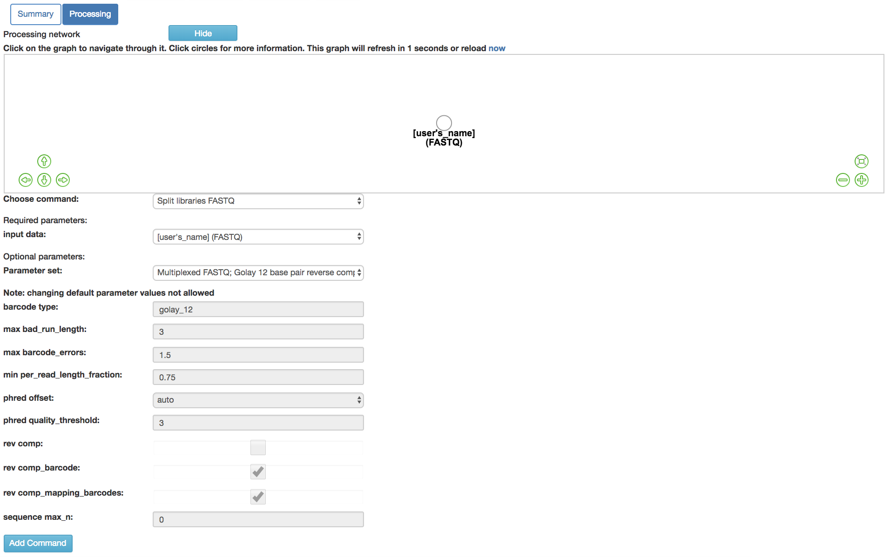

For our files, choose "Multiplexed FASTQ; Golay 12 base pair reverse complement
mapping file barcodes with reverse complement barcodes".
The specific parameter values used will be displayed below.  
**For most raw data coming out of the Knight Lab you will use the same setting.**

Click "Add Command".

You'll see the files network update. In addition to the original white object,
you should now see the processing command (represented in yellow) and the object
that will be produced from that command (represented in grey).

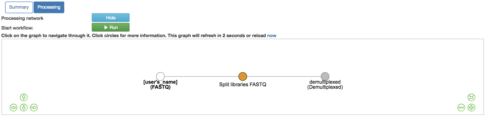

You can click on the command to see the parameters used, or on an object to
perform additional steps.

Next we want to trim to a particular length, to ensure our samples will be comparable to other samples already in the database. Click back on the “demultiplexed (Demultiplexed)”. This time, select the Trimming operation. Currently, there are seven trimming length options. Let’s choose “100 basepairs”, which trims to the first 100bp, for this run, and click “Add Command”.

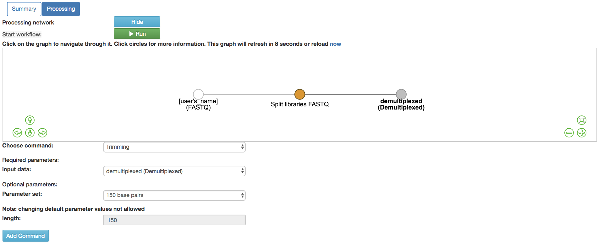

Click “Add Command”, and you will see the network update:

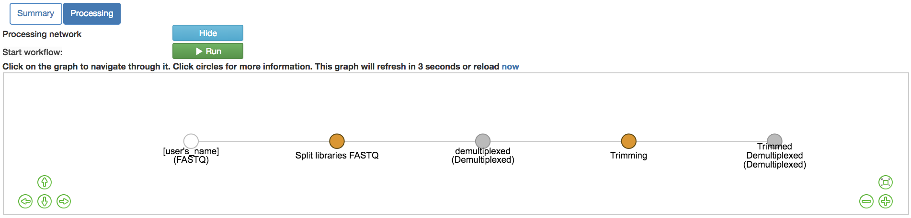
   
Note that the commands haven't actually been run yet! (We'll still need to click
"Run" at the top.) This allows us to add multiple processing steps to our study
and then run them all together.

We're going to process our sequences files using two different workflows. In
the first, we'll use a conventional reference-based OTU picking strategy to
cluster our 16S sequences into OTUs. This approach matches each sequence to a
reference database, ignoring sequences that don't match the reference. In the
second, we will use `deblur <http://msystems.asm.org/content/2/2/e00191-16>`__,
which uses an algorithm to remove sequence error, allowing us to work with
unique sequences instead of clustering into OTUs. Both of these approaches work
great with Qiita, because we can compare the observations between studies
without having to do any sort of re-clustering!

The closed-reference workflow
-----------------------------

To do closed reference OTU picking, click on the "Trimmed Demultiplexed 100 (Demultiplexed)" object and
select the "Pick closed-reference OTUs" command. We will use the "Defaults"
parameter set for our data, which are relatively small. For a larger
data set, we might want to use the "Defaults - parallel" implementation.

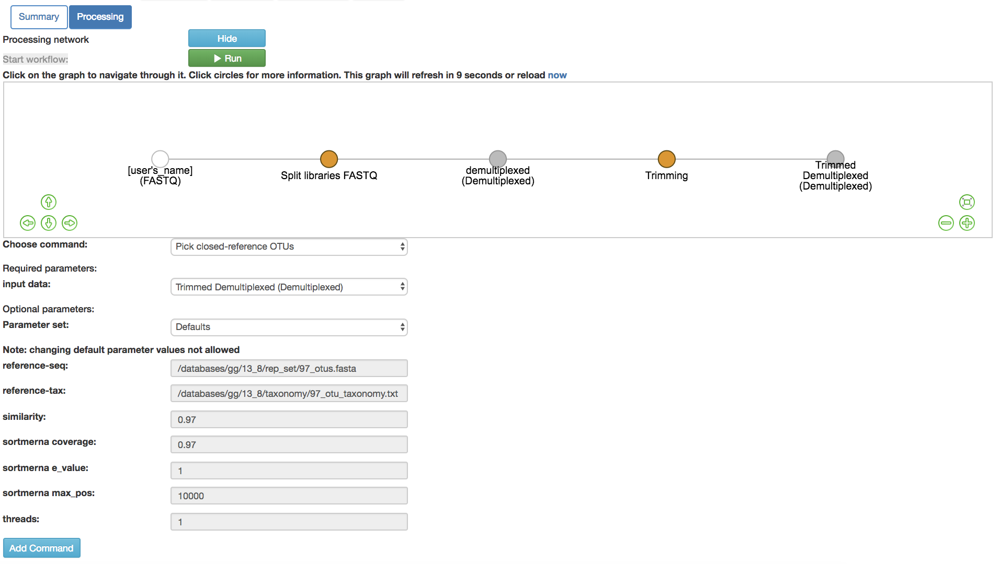

By default, Qiita uses the GreenGenes 16S reference database. You can also
choose to use the Silva 119 18S databsase, or the UNITE 7 fungal ITS database.

Click "Add Command", and you will see the network update:

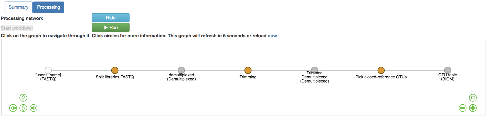

Here you can see the blue "Pick closed-reference OTUs" command added, and that
the product of the command is a BIOM-formatted OTU table.

That's it!

The deblur workflow
-------------------

The deblur workflow is only marginally more complex. Although you can deblur
the demultiplexed sequences directly, "deblur" works best when all the
sequences are the same length. By trimming to a particular length, we can also
ensure our samples will be comparable to other samples already in the database.

Click back on the "Trimmed Demultiplexed 100 (Demultiplexed)" object. This time, select the `Deblur`
operation. Choose "Deblur" from the "Choose command" dropdown, and "Defaults" for
the parameter set. 

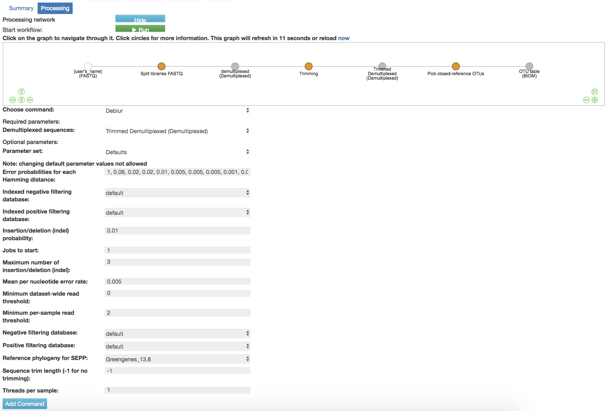
   
Add this command to create this workflow:

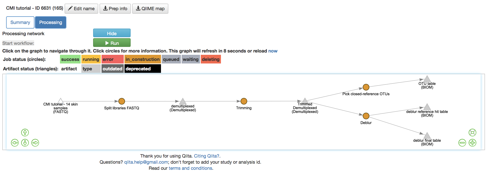

Now you can see that we have the same "Trimmed Demultiplexed (Demultiplexed)" object being used for two
separate processing steps -- closed-reference OTU picking, and deblur.

As you can see, "deblur" produces two BIOM-formatted OTU tables as output. The
"deblur reference hit table (BIOM)" contains deblurred sequences that have been filtered to
try and exclude things like organellar mitochondrial reads, while "deblur final
table (BIOM)" has all the sequences.

Running the workflow
--------------------

Now, we can see the whole set of commands and their output files:

Click "Run" at the top of the screen, and Qiita will start executing all of
these jobs. You'll see a "Workflow submitted" banner at the top of your window.

The full workflow can take time to load depending on the amount of samples and Qiita workload. You can keep track of what is running by looking at the colors of the command artifacts. If yellow, the commands are being run now. If green, the commands have successfully been run. If red, the commands have failed.

.. figure::  images/full_workflow6.png
   :align:   center

As noted above, you can follow the process of your commands in the dialogue at
the top right of the window.

You can also click on the "Jobs using this data", and see status
updates from the commands running on that object at the bottom of the page:

.. figure::  images/jobs_data2.png
   :align:   center

Once objects have been generated, you can generate summaries for them just
as you did for the original "FASTQ" object. 

The summary for the "demultiplexed (Demultiplexed)" object gives you information about the
length of sequences in the object:

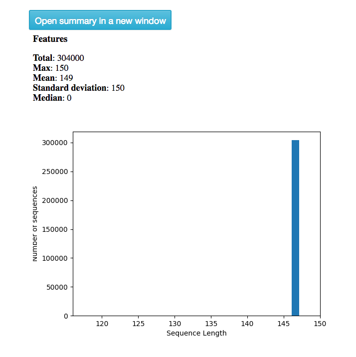

The summary for a BIOM-format OTU table gives you a table summary, details regarding the frequency per sample, and a histogram of the number of features per sample:

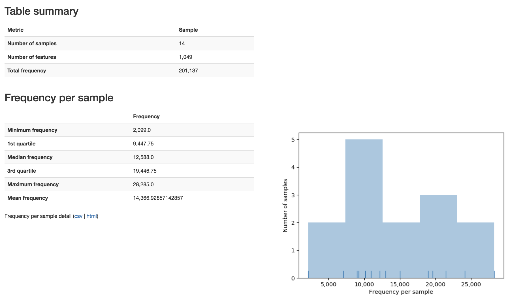

----

Next: :doc:`qiita-16S-analysis`
