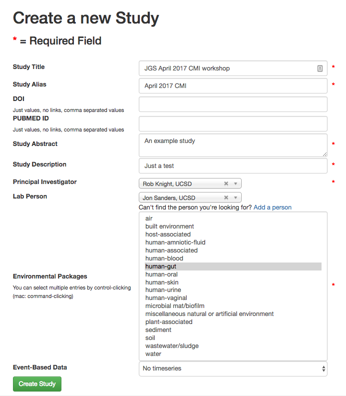
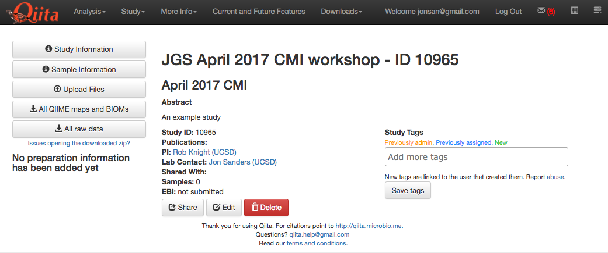
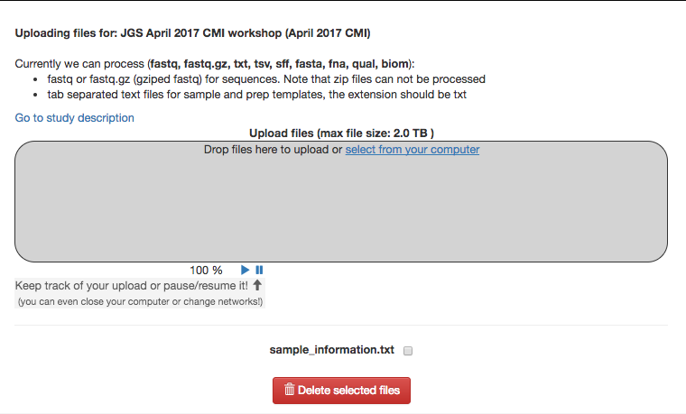
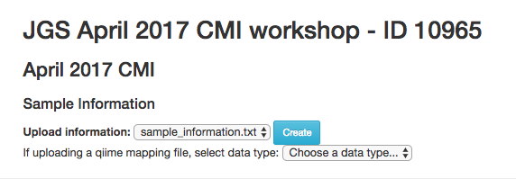
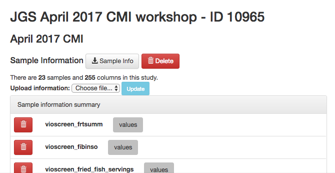
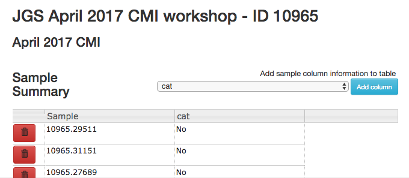

Creating a study in Qiita
=========================

This tutorial will walk you through creation of your account and a test study
in Qiita.

Getting CMI Workshop example data
---------------------------------

First, we'll download some `example data <https://www.dropbox.com/s/1vcnjqo6kkmetp6/qiita-files.zip?dl=0>`__. These files contain both 16S and shotgun metagenomics 
data for 12 samples from the American Gut Project. 

For this tutorial, the relevant files are::

    qiita-files/16S/*.fastq.gz        # The actual 16S sequences, one per sample
    qiita-files/sample_information.txt   # The sample information file
    qiita-files/prep_template_16S.txt # The prep information file

Next, we'll sign up for Qiita and create a study for these data.

Signing up for a Qiita account
------------------------------

Open your browser (it must be Chrome or Firefox) and go to `Qiita <https://qiita.ucsd.edu>`__ (https://qiita.ucsd.edu).

Click on "New User".

.. figure::  images/image14.png
   :align:   center

.. figure::  images/image07.png
   :align:   center

The "New User" link brings you to a page on which you can create a new
account. Optional fields are indicated explicitly, while all other
fields are required. Once the form is submitted, an email will be sent
to you containing instructions on how to verify your email address.

Once you have created your account, you can log into the system by
entering your email and password.

.. figure::  images/image03.png
   :align:   center

Creating a test study
---------------------

Studies are the source of data for Qiita. Studies can contain only one set
of samples but can contain multiple sets of raw data, each of which can have a
different preparation -- for example, 16S, shotgun metagenomics, and
metabolomics, or even multiple preparations of the same type (e.g., a plate rerun, biological and technical replicates, etc).

In this tutorial, our study contains 12 samples, each with two types of data:
16S and shotgun metagenomics. To represent this project in Qiita, you will need
to create a single study with a single sample information file that contains all
12 samples. Then, you will link separate preparation files for each data type.

Creating an example study
-------------------------

To create a study, click on the "Study" menu and then on "Create Study".
This will take you to a new page that will gather some basic information
to create your study.

.. figure::  images/image18.png
   :align:   center

The "Study Title" has to be unique system-wide. Qiita will check this
when you try to create the study, and may ask you to alter the study
name if the one you provide is already in use.

A principal investigator is required, and a list of known PIs is
provided. If you cannot find the name you are looking for in this
list, you can choose to add a new one.

Select the environmental package appropriate to your study. Different
packages will request different specific information about your samples.
This information is optional; for more details, see the metadata
section.

There is also an option to specify time series type ("Event-Based Data") if you
have time series data. In our case, the samples come from a cross-sectional
study design, so you should select "No time series." For more information on
time series types, you can check out the
`in-depth tutorial <https://qiita.ucsd.edu/static/doc/html/tutorials/getting-started.html#creating-a-study>`__
on the Qiita website.

Once your study has been created, you will be informed by a green
message; click on the study name to begin adding your data.

Adding sample information
-------------------------

**Sample information** is the set of metadata that pertains to your biological
samples: these are the measured variables that are motivating you to look for
response variables in the microbiome. **IMPORTANT**: your metadata are your
study; it is imperative that those data are consistent, correct, and
sufficiently detailed. (To learn more, including how to format your own sample
info file, check out the `in-depth documentation <https://qiita.ucsd.edu/static/doc/html/tutorials/prepare-information-files.html#sample-information-file>`__
on the Qiita website.)

The first point of entrance to a study is the study description
page. Here you will be able to edit the study info, upload files, and
manage all other aspects of your study.

The first step after study creation is uploading files. Click on the
"Upload Files" button: as shown in the figure below, you can now drag-and-drop
files into the grey area or simply click on "select from your computer"
to select the fastq, fastq.gz or txt files you want to upload.

Uploads can be paused at any time and restarted again, as long as you do
not refresh or navigate away from the page, or log out of the system
from another page.

Drag the file named "sample_information.txt" into the upload box. It should
upload quickly and appear with a checkbox next to it below.

Once your file has uploaded, click on "Go to study description" and, once
there, click on the "Sample Information" tab.  Select your sample information
from the dropdown menu next to "Upload information" and click "Create".

If something is wrong with the sample information file, Qiita will let you know
with a red banner a the top of the screen.

If the file processes successfully, you should be able to click on the "Sample
Information" tab and see a list of the imported metadata fields. 

You can also click on "Sample Summary" to check out the different metadata
values. Select a metadata column to visualize in the dropdown menu and click
"Add column." 

In this cohort, only three people were sensible enough to own a cat.

Next, we'll add 16S data and do a preliminary analysis.

----

Next: :doc:`qiita-16S-processing`