Analysis of Shotgun Metagenomic Data
------------------------------------

We will begin our analysis with the Qiita study you created as part of the 'Shotgun metagenomics processing' tutorial. Start by viewing the processing network for the Metagenomic preparation in that study:

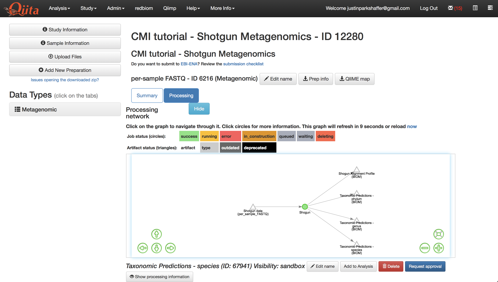

Lets take full advantage of the resolution that metagenomic data provides, and analyze our data at the species-level. Select the 'Taxonomic Predictions - species' artifact in the processing network.
   
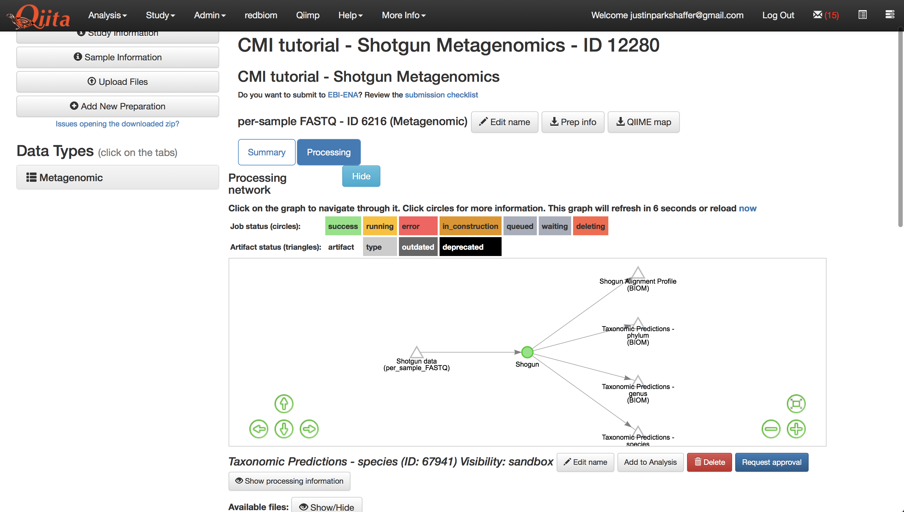
   
Click the button under the processing network labeled 'Add to analysis'. A menu will appear in the top right-hand corner of the screen, and the icon it is derived from will change to be colored green as shown below.

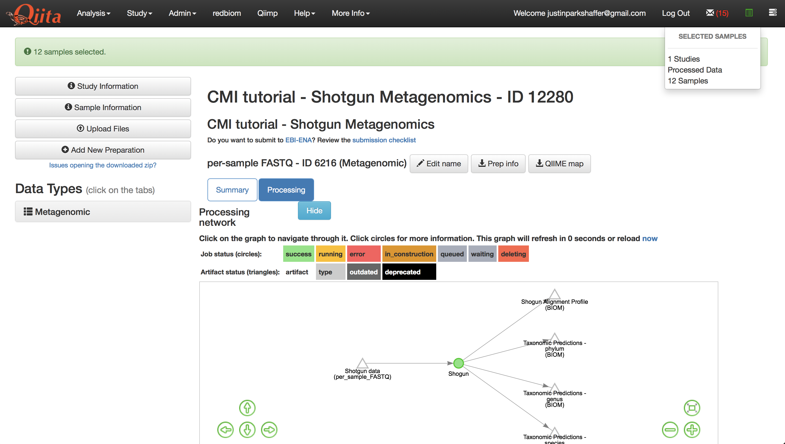

Click the green icon to proceed with creating the analysis.

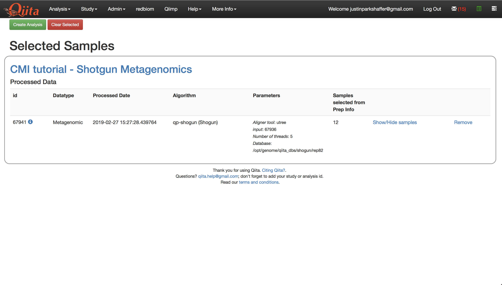
   
Click 'Create Analysis'. This will bring up a window where you must give the analysis a name and description of your choosing. Click 'Create Analysis'.

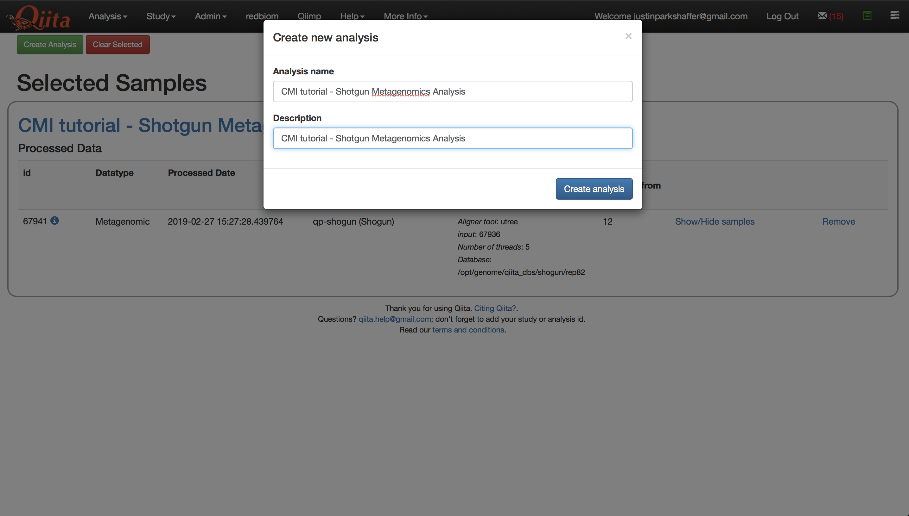
   
Once the analysis has been created, you will see a processing network with a single artifact named 'dflt name' - this is the species-level feature-table that we brought over.

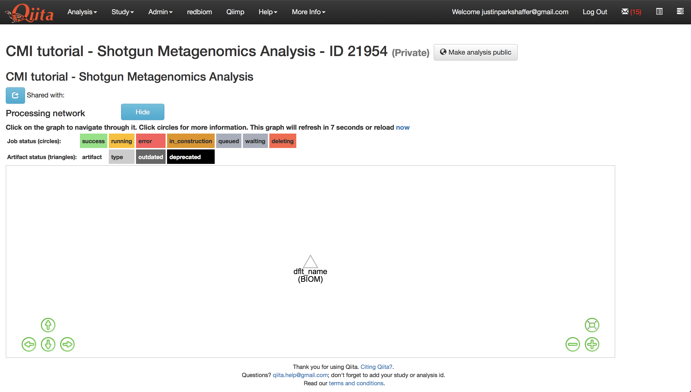
   
Select the artifact and click 'Process', then select 'Visualize taxonomy with an interactive bar plot', and click 'Add Command'.

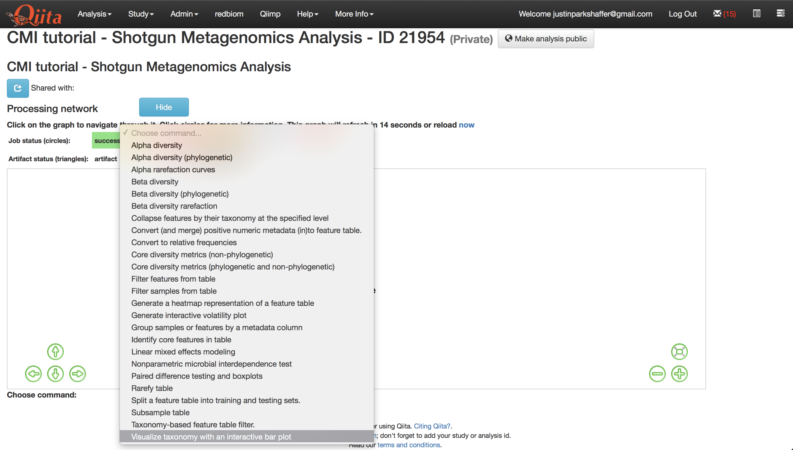
   
This will create new artifacts in the analysis processing network as shown below.

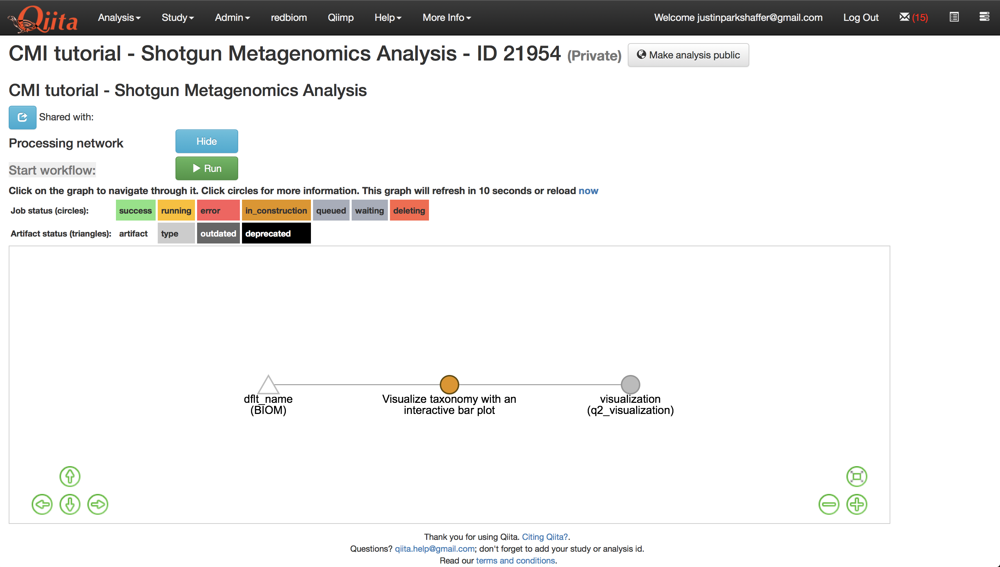

Let's add some additional commands before running our job. Select the species-level feature-table again but this time select the command 'Core diversity metrics (non-phylogenetic)'. Enter 1500 into the last field - this is the rarefaction depth - or number of reads that each sample will be subsampled to, and then 'Add Command'.

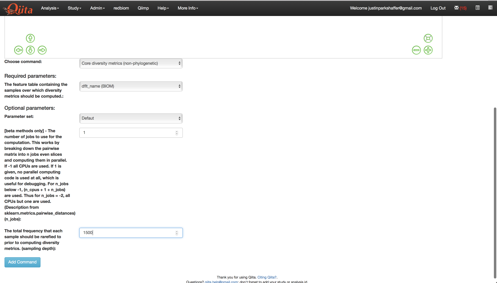

 This will bring up several new artifacts in the processing network as shown below.
 
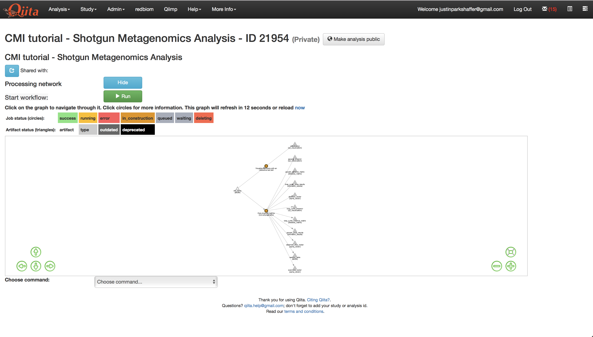
   
Now we are ready to run the analysis. Click 'Run' above the processing network. Once the analyses are complete, you can explore the taxonomy barplots and emperor visualizations of principle coordinates analyses of beta-diversity, as well as perform additional analyses such as alpha correlation or comparisons.

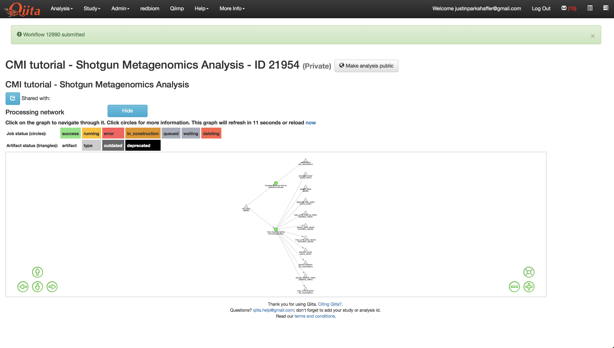
   
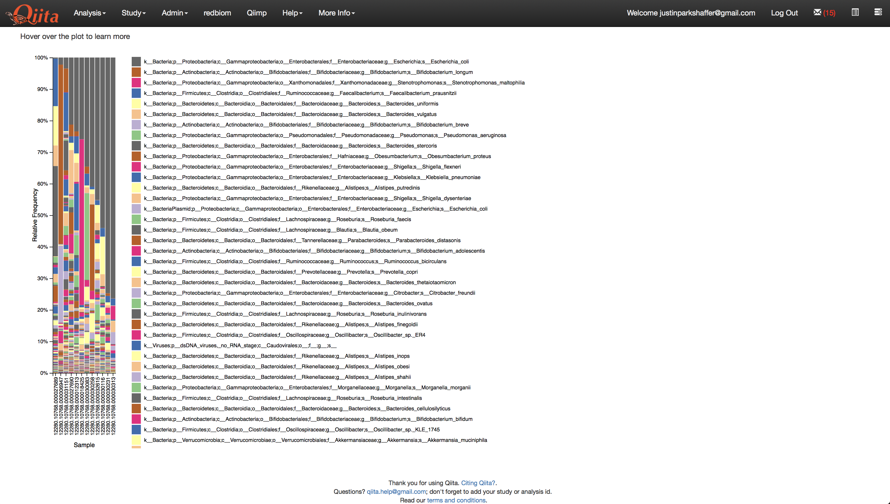
   
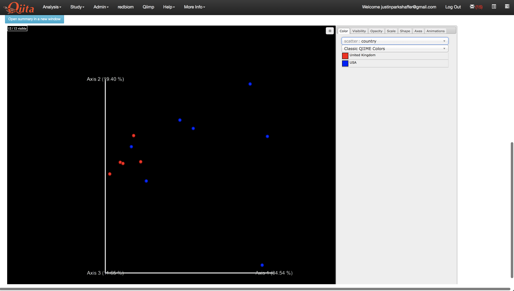
