Shotgun metagenomics is an alternative approach to amplicon sequencing that provides information at the genomic level, rather than for single loci such as 16S, 18S, and the fungal ITS region. In addition to providing finer resolution with respect to taxonomic classification, metagenomics provides functional data that allows for more comprehensive analyses of microbial communities. We are currently working to make available additional metagenomic tools in Qiita. Below we describe how to use Shogun to produce taxonomic profiles for shotgun metagenomic data, as well as common downstream analyses of alpha- and beta-diversity.

Processing Shotgun Metagenomics Data
------------------------------------

We will start by creating a new study with shotgun metagenomic data for 23 human fecal samples subsetted from the American Gut Project. As above for amplicon data, go to the study drop-down menu and select 'Create Study'. Complete the necessary fields similar as shown below.

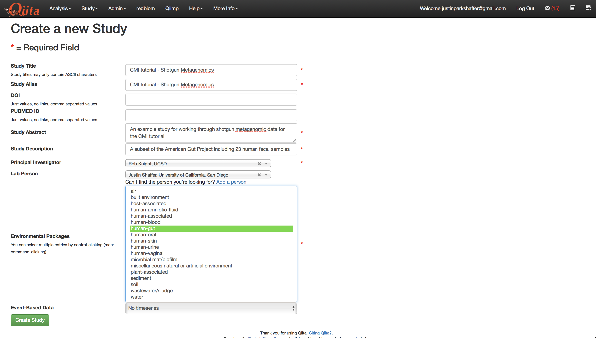
   
Once the study has been created, click on the study name in the green banner to go to the study page. Click on 'Upload Files', and upload the contents of the `shotgun data <https://github.com/biocore/cmi-workshops/tree/master/docs/example_data>`__.

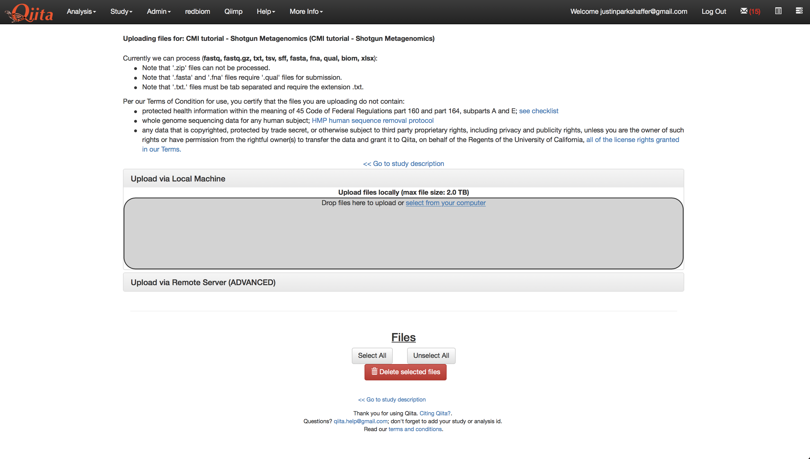

Once the files are uploaded, click on 'Sample Information' on the left side of the screen and select the sample information file 'CMI_shotgun-metagenomics_tutorial_sample_info.txt' and click 'Create'.

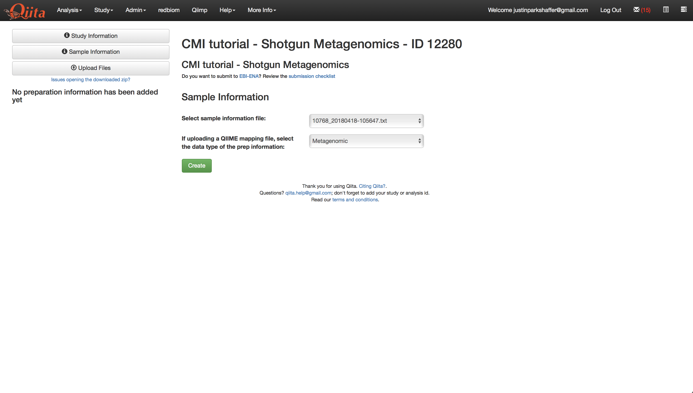

Once complete, click 'Add New Preparation'. Give the preparation a name of your choosing, select the prep info file, 'CMI_shotgun-metagenomics_tutorial_prep_info', and select 'Metagenomic' in both of the drop-down menus. Then click 'Create New Preparation'.

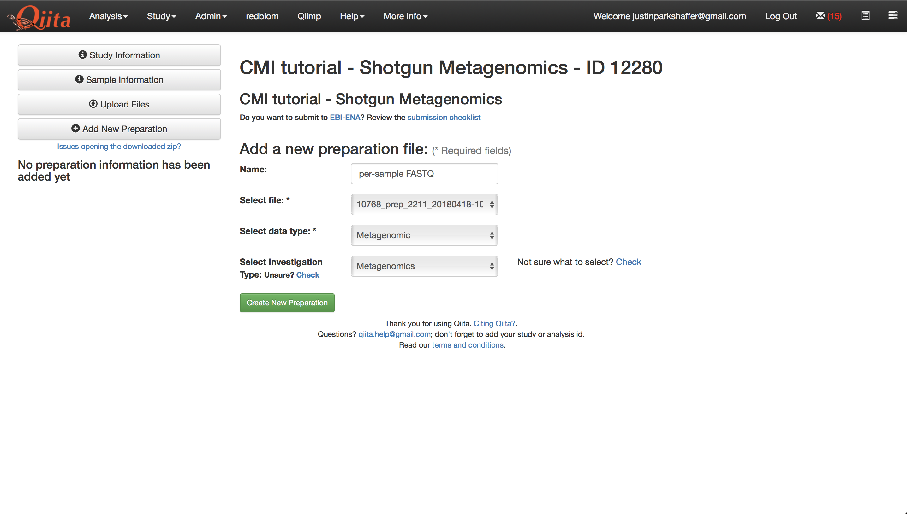

This will create a new preparation under 'Data Types'. Click on the new preparation and then the prep ID text. This will open up options for which you should select 'per_sample_FASTQ - None', and give the files a name. Then click 'Add Files'.

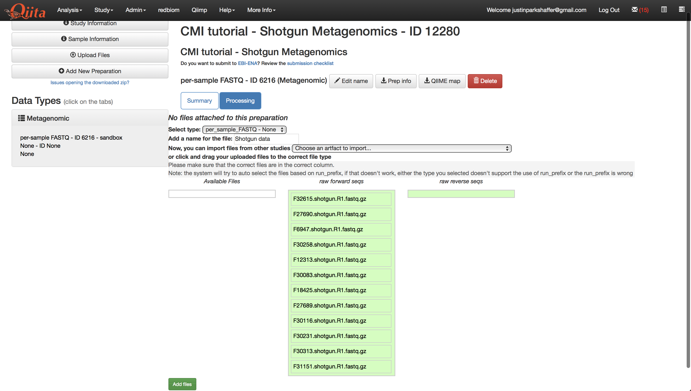
   
Once your sequence files are added, you should see a processing network with an artifact representing the sequence data.

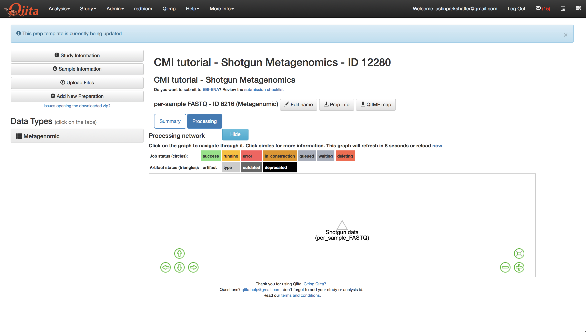
   
We will now process the sequence data using Shogun to create taxa-abundance tables at three hierarchical levels: phylum, family, and genus. Shogun is a metagenomic tool for assigning sequence reads to metagenomes, and taxonomic classification using a reference database. In Qiita, Shogun uses either **utree** or **bowtie2** to align to references.

Running Shogun on human-filtered per-sample FASTQ data
------------------------------------------------------
All shotgun metagenomic data is filtered of human reads prior to being uploaded to Qiita. To process the data using Shogun, click on the per-sample FASTQ artifact named 'Shotgun data' and click 'Process'.

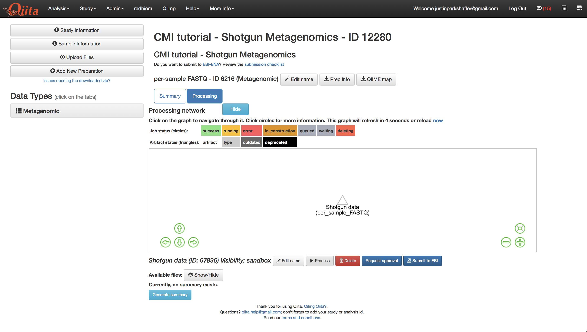
   
From the dropdown menu, select 'Shogun'.

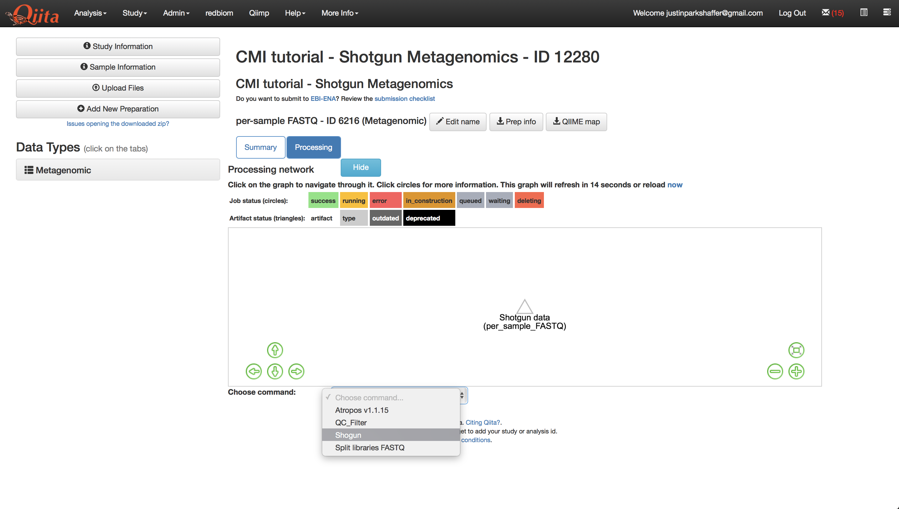
   
Change the 'Parameter set' to 'rep82_utree' and click 'Add Command'.

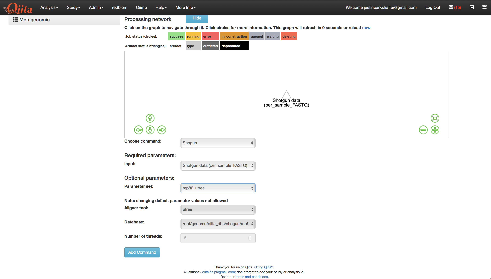
   
You should see the command added to the processing network:

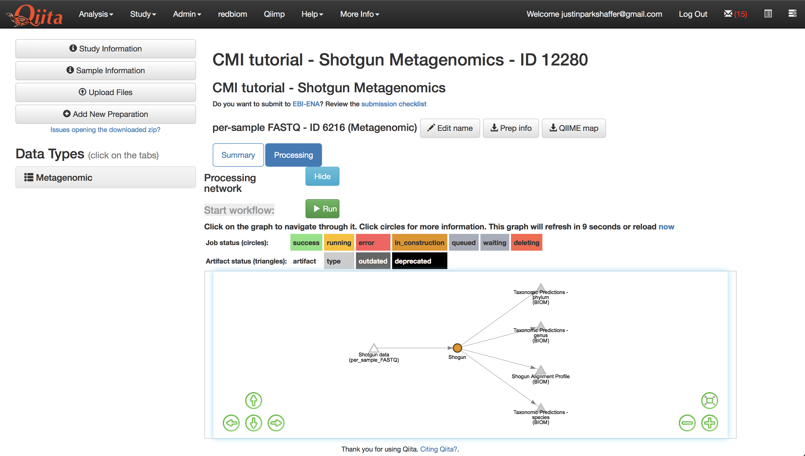
   
Click 'Run' to run the command.

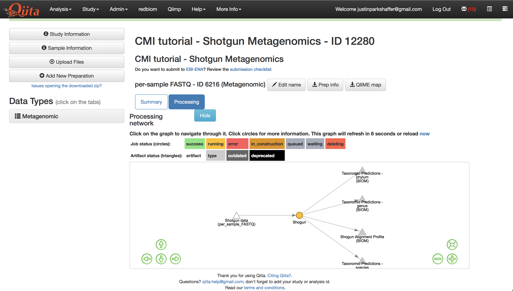
   
Once the command has completed, click on the 'Taxonomic Predictions - species' artifact.

.. figure::  images/shotgun-process-shogun6.png
   :align:   center
   
Examine the table summary to see the number of samples that were retained, and the number of features that were assembled.

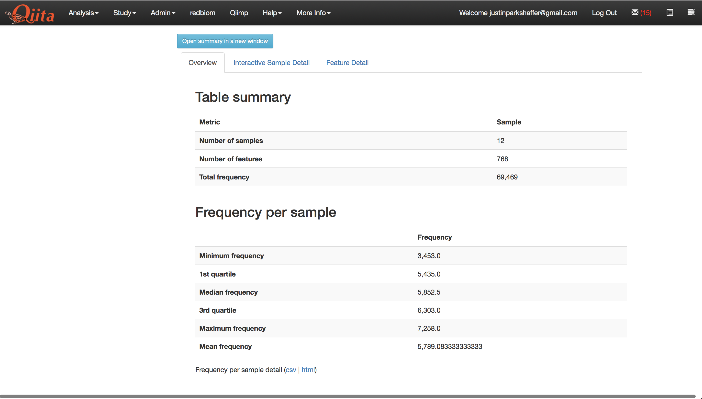
   
In the next section we will begin an analysis starting with this feature-table.
