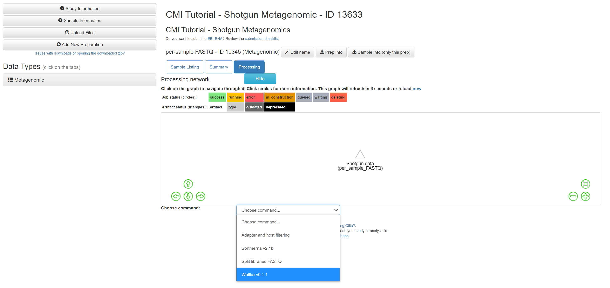
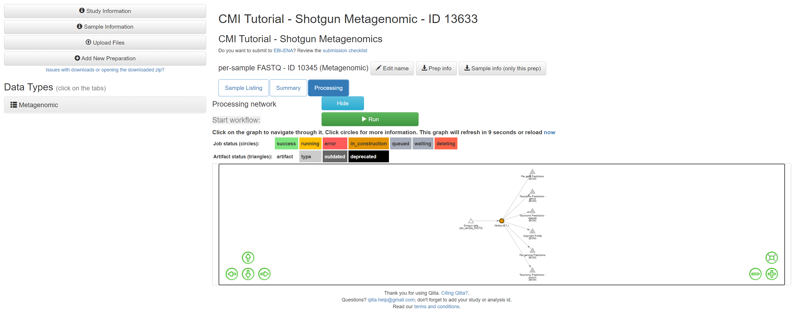

Shotgun metagenomics is an alternative approach to amplicon sequencing that provides information at the genomic level, rather than for single loci such as 16S, 18S, and the fungal ITS region. In addition to providing finer resolution with respect to taxonomic classification, metagenomics provides functional data that allows for more comprehensive analyses of microbial communities. We are currently working to make available additional metagenomic tools in Qiita. Below we describe how to use `Woltka <https://github.com/qiyunzhu/woltka>`__ to produce taxonomic profiles for shotgun metagenomic data, and then move to common downstream analyses of alpha- and beta-diversity.

Processing Shotgun Metagenomic Data
------------------------------------

We will start by creating a new study with shotgun metagenomic data for 23 human fecal samples subsetted from the American Gut Project. As we did for amplicon data, go to the study drop-down menu and select 'Create Study'. Complete the necessary fields similar as shown below.

   
Once the study has been created, click on the study name in the green banner to go to the study page. Click on 'Upload Files', and upload the contents of the `shotgun data <https://github.com/biocore/cmi-workshops/tree/master/docs/example_data>`__.

.. figure::  images/shotgun-process-upload.png
   :align:   center

Once the files are uploaded, click on 'Sample Information' on the left side of the screen and select the sample information file 'qiita_shotgun_metagenomic_tutorial_sample_info.txt' and click 'Create'.

Once complete, you may need to refresh your screen to see the added option of 'Add New Preparation'. Click 'Add New Preparation' and give the preparation a name of your choosing. Select the prep info file, 'qiita_shotgun-metagenomic_tutorial_prep_info.txt', and select 'metagenomic' in the first drop-down menu, and 'WGS' (whole genome sequencing) in the second. Then click 'Create New Preparation'.

This will create a new preparation under 'Data Types'. You can click on the new preparation which will show the name of your preparation. You can click on this preparation or the page will automatically open the preparation once you create it.  Of the new options you should select 'per_sample_FASTQ - None', and give the files a name. Then click 'Add Files'.

.. figure::  images/shotgun-process-add-files.png
   :align:   center
   
Once your sequence files are added, you should see a processing network with an artifact representing the sequence data.

.. figure::  images/shotgun-process-network.png
   :align:   center
   
We will now process the sequence data using Woltka to create taxa-abundance tables at three hierarchical levels: phylum, family, and genus. Woltka (Web of Life Toolkit App), is a bioinformatics package for shotgun metagenome data analysis that we will use for taxonomic classification of sequences using a reference database. Woltka uses `Web of Life (WoL) <https://biocore.github.io/wol/>`__ to align to references.

Running Woltka on human-filtered per-sample FASTQ data
------------------------------------------------------
All shotgun metagenomic data is filtered of human reads prior to being uploaded to Qiita. If you have additional, non-human host reads that you would like to filter from your data, you can see if they are available under the command, 'QC_Filter'. To proceed with processing the data using Woltka, click on the per-sample FASTQ artifact named 'Shotgun data' and click 'Process'.

.. figure::  images/shotgun-process-shogun1.png
   :align:   center
   
From the dropdown menu, select 'Woltka'.

   
Change the 'Parameter set' to 'wol' and click 'Add Command'.

.. figure::  images/shotgun-process-woltka3.PNG
   :align:   center
   
You should see the command added to the processing network:

   
Click 'Run' to run the command.

   
Once the command has completed, click on the 'Taxonomic Predictions - species' artifact.

.. figure::  images/shotgun-process-woltka6.PNG
   :align:   center
   
Examine the table summary to see the number of samples that were retained, and the number of features that were assembled.

   
In the next section we will begin an analysis starting with this feature-table.
